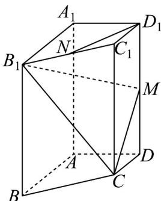

<!-- question-source:start -->
1．（2024·天津·高考真题）已知四棱柱 $ABCD - A_1B_1C_1D_1$ 中，底面 $ABCD$ 为梯形， $AB // CD$ ， $A_1A \perp$ 平面 $ABCD$ ， $AD \perp AB$ ，其中 $AB = AA_1 = 2, AD = DC = 1$ 。 $N$ 是 $B_1C_1$ 的中点， $M$ 是 $DD_1$ 的中点。

(1)求证 $D_{1}N / /$ 平面 $CB_{1}M$

(2)求平面 $CB_{1}M$ 与平面 $BB_{1}CC_{1}$ 的夹角余弦值；

(3)求点 $B$ 到平面 $CB_{1}M$ 的距离.
<!-- question-source:end -->

![[高中/真题/按题型分类/专题21 立体几何大题综合/考点06_求线面角及最值或范围/真题/answers/Q00035894A1.md]]
