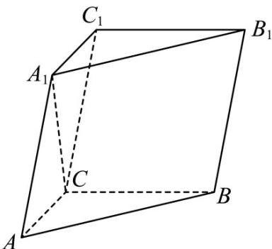

<!-- question-source:start -->
3. (2023·全国甲卷·高考真题) 如图, 在三棱柱 $ABC - A_{1}B_{1}C_{1}$ 中, $A_{1}C \perp$ 底面 $ABC$ , $\angle ACB = 90^{\circ}, AA_{1} = 2$ , $A_{1}$ 到平面 $BCC_{1}B_{1}$ 的距离为 1.

<!-- question-source:end -->

![[高中/真题/按题型分类/专题21 立体几何大题综合/考点06_求线面角及最值或范围/真题/answers/Q00035896A1.md]]
