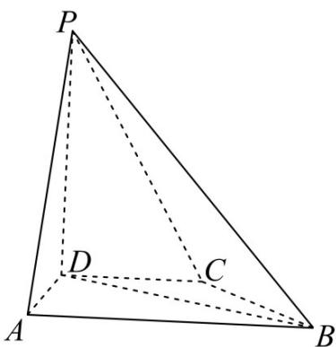

<!-- question-source:start -->
4.（2022·全国甲卷·高考真题）在四棱锥 $P - ABCD$ 中， $PD \perp$ 底面 $ABCD, CD \parallel AB, AD = DC = CB = 1, AB = 2, DP = \sqrt{3}$

(1)证明： $BD \perp PA$ ；

(2)求 $PD$ 与平面 $PAB$ 所成的角的正弦值.
<!-- question-source:end -->

![[高中/真题/按题型分类/专题21 立体几何大题综合/考点06_求线面角及最值或范围/真题/answers/Q00035897A1.md]]
