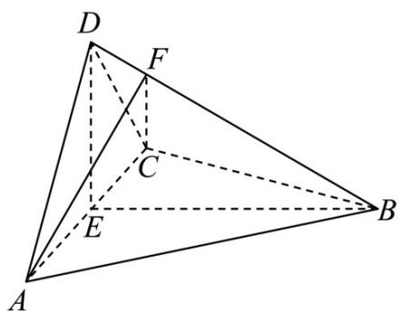

<!-- question-source:start -->
5．（2022·全国乙卷·高考真题）如图，四面体 ABCD 中， $AD \perp CD, AD = CD, \angle ADB = \angle BDC$ ，E 为 AC 的中点．

(1)证明：平面 $BED \perp$ 平面 $ACD$ ；

(2)设 $AB = BD = 2, \angle ACB = 60^{\circ}$ ，点 $F$ 在 $BD$ 上，当 $\triangle AFC$ 的面积最小时，求 $CF$ 与平面 $ABD$ 所成的角的正弦值。
<!-- question-source:end -->

![[高中/真题/按题型分类/专题21 立体几何大题综合/考点06_求线面角及最值或范围/真题/answers/Q00035898A1.md]]
