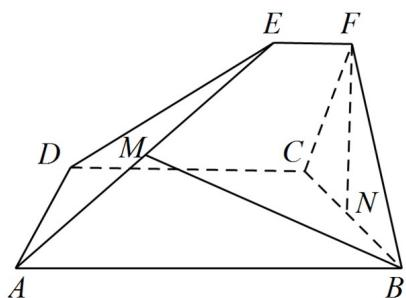

<!-- question-source:start -->
6．（2022·浙江·高考真题）如图，已知ABCD和CDEF都是直角梯形， $AB//DC$ ， $DC//EF$ ，AB=5，DC=3，EF=1， $\angle BAD=\angle CDE=60^{\circ}$ ，二面角F-DC-B的平面角为 $60^{\circ}$ ．设M，N分别为AE,BC的中点．

<!-- question-source:end -->

![[高中/真题/按题型分类/专题21 立体几何大题综合/考点06_求线面角及最值或范围/真题/answers/Q00035899A1.md]]
