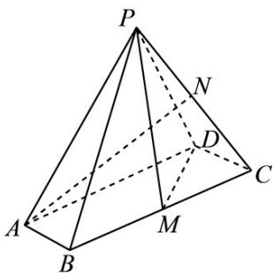

<!-- question-source:start -->
8.（2021·浙江·高考真题）如图，在四棱锥 P-ABCD 中，底面 ABCD 是平行四边形， $\angle ABC=120^{\circ}, AB=1, BC=4, PA=\sqrt{15}$ ，M，N 分别为 BC, PC 的中点， $PD\perp DC, PM\perp MD$ .

(1) 证明： $AB \perp PM$ ;

(2) 求直线 AN 与平面 PDM 所成角的正弦值.
<!-- question-source:end -->

![[高中/真题/按题型分类/专题21 立体几何大题综合/考点06_求线面角及最值或范围/真题/answers/Q00035901A1.md]]
