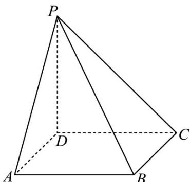

<!-- question-source:start -->
9. (2020·海南·高考真题) 如图, 四棱锥 $P-ABCD$ 的底面为正方形, $PD \perp$ 底面 $ABCD$ . 设平面 $PAD$ 与平面 $PBC$ 的交线为 $l$ .

<!-- question-source:end -->

![[高中/真题/按题型分类/专题21 立体几何大题综合/考点06_求线面角及最值或范围/真题/answers/Q00035902A1.md]]
