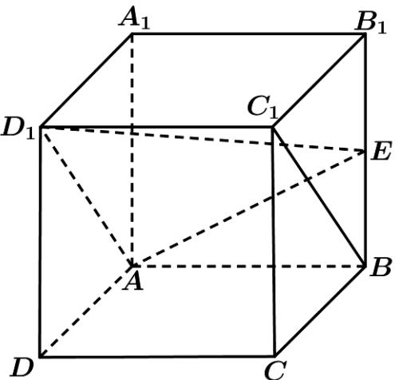

<!-- question-source:start -->
11. (2020·北京·高考真题) 如图, 在正方体 $ABCD - A_1B_1C_1D_1$ 中, $E$ 为 $BB_{1}$ 的中点.

(Ⅰ) 求证： $BC_{1} //$ 平面 $AD_{1}E$ ；

(Ⅱ) 求直线 $AA_{1}$ 与平面 $AD_{1}E$ 所成角的正弦值.
<!-- question-source:end -->

![[高中/真题/按题型分类/专题21 立体几何大题综合/考点06_求线面角及最值或范围/真题/answers/Q00035904A1.md]]
