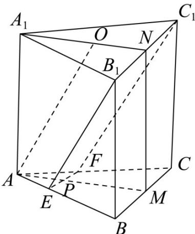

<!-- question-source:start -->
14．（2020·全国·高考真题）如图，已知三棱柱 $ABC-A_{1}B_{1}C_{1}$ 的底面是正三角形，侧面 $BB_{1}C_{1}C$ 是矩形，M，N分别为BC， $B_{1}C_{1}$ 的中点，P为AM上一点，过 $B_{1}C_{1}$ 和P的平面交AB于E，交AC于F.

<!-- question-source:end -->

![[高中/真题/按题型分类/专题21 立体几何大题综合/考点06_求线面角及最值或范围/真题/answers/Q00035907A1.md]]
