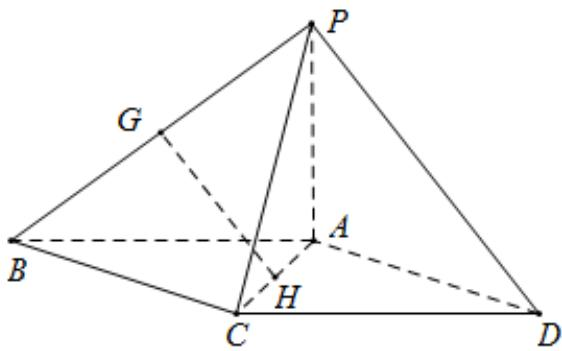

<!-- question-source:start -->
15．（2019·天津·高考真题）如图，在四棱锥 P-ABCD 中，底面 ABCD 为平行四边形， $\triangle PCD$ 为等边三角形，平面 PAC⊥平面 PCD，PA⊥CD，CD=2，AD=3，

(1) 设 $G, H$ 分别为 $PB, AC$ 的中点，求证： $GH \parallel$ 平面 $PAD$ ；

(Ⅱ) 求证： $PA \perp$ 平面 PCD；

(Ⅲ) 求直线 AD 与平面 PAC 所成角的正弦值.
<!-- question-source:end -->

![[高中/真题/按题型分类/专题21 立体几何大题综合/考点06_求线面角及最值或范围/真题/answers/Q00035908A1.md]]
