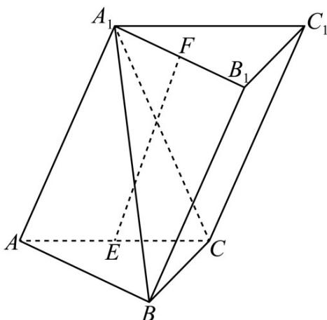

<!-- question-source:start -->
16. (2019·浙江·高考真题) 如图, 已知三棱柱 $ABC - A_1B_1C_1$ , 平面 $AA_1C_1C \perp$ 平面 $ABC, \angle ABC = 90^\circ$ , $\angle BAC = 30^\circ$ , $A_1A = A_1C = AC, E, F$ 分别是 $AC, A_1B_1$ 的中点.

(1) 证明： $EF \perp BC$ ;

(2) 求直线 EF 与平面 $A_{1}BC$ 所成角的余弦值.
<!-- question-source:end -->

![[高中/真题/按题型分类/专题21 立体几何大题综合/考点06_求线面角及最值或范围/真题/answers/Q00035909A1.md]]
