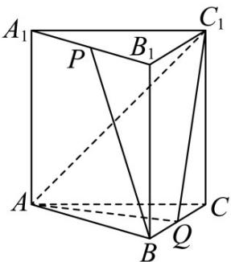

<!-- question-source:start -->
17．（2018·江苏·高考真题）如图，在正三棱柱 $ABC-A_{1}B_{1}C_{1}$ 中， $AB=AA_{1}=2$ ，点P，Q分别为 $A_{1}B_{1}$ ，BC的中点。

(1) 求异面直线 BP 与 $AC_{l}$ 所成角的余弦值；

(2) 求直线 $CC_{1}$ 与平面 $AQC_{1}$ 所成角的正弦值
<!-- question-source:end -->

![[高中/真题/按题型分类/专题21 立体几何大题综合/考点06_求线面角及最值或范围/真题/answers/Q00035910A1.md]]
