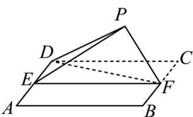

<!-- question-source:start -->
19.（2018·全国·高考真题）如图，四边形ABCD为正方形，E,F分别为AD,BC的中点，以DF为折痕把 $\triangle DFC$ 折起，使点C到达点P的位置，且 $PF\perp BF$ .

(1) 证明：平面 $PEF \perp$ 平面 $ABFD$ ；

(2) 求 DP 与平面 ABFD 所成角的正弦值.

<!-- question-source:end -->

![[高中/真题/按题型分类/专题21 立体几何大题综合/考点06_求线面角及最值或范围/真题/answers/Q00035911A1.md]]
