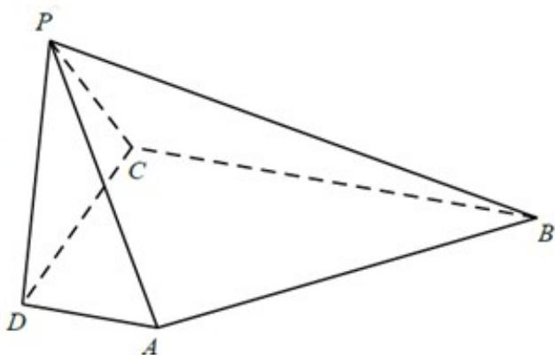

<!-- question-source:start -->
22．（2017·天津·高考真题）如图，在四棱锥P-ABCD中，AD⊥平面PDC， $AD\parallel BC$ ， $PD\perp PB$ ，
AD = 1, BC = 3, CD = 4, PD = 2.

(1) 求异面直线 AP 与 BC 所成角的余弦值；

(Ⅱ) 求证： $PD \perp$ 平面 PBC；

(Ⅲ) 求直线 AB 与平面 PBC 所成角的正弦值.

<!-- question-source:end -->

![[高中/真题/按题型分类/专题21 立体几何大题综合/考点06_求线面角及最值或范围/真题/answers/Q00035914A1.md]]
