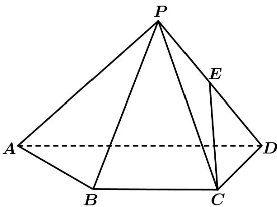

<!-- question-source:start -->
23. (2017·浙江·高考真题) 如图, 已知四棱锥 P-ABCD, △PAD 是以 AD 为斜边的等腰直角三角形, BC∥AD, CD⊥AD, PC=AD=2DC=2CB,E 为 PD 的中点.

(1) 证明：CE∥平面 PAB；

(Ⅱ) 求直线 CE 与平面 PBC 所成角的正弦值

<!-- question-source:end -->

![[高中/真题/按题型分类/专题21 立体几何大题综合/考点06_求线面角及最值或范围/真题/answers/Q00035915A1.md]]
