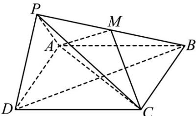

<!-- question-source:start -->
24．（2017·北京·高考真题）如图，在四棱锥 P-ABCD 中，底面 ABCD 为正方形，平面 PAD⊥平面 ABCD，
点 M 在线段 PB 上， $PD \parallel$ 平面 MAC ， $PA = PD = \sqrt{6}$ ，AB = 4。

(1) 求证：M 为 PB 的中点；

(2) 求二面角 B - PD - A 的大小；

(3) 求直线 MC 与平面 BDP 所成角的正弦值.
<!-- question-source:end -->

![[高中/真题/按题型分类/专题21 立体几何大题综合/考点06_求线面角及最值或范围/真题/answers/Q00035916A1.md]]
