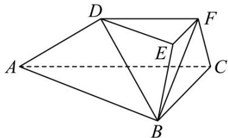

<!-- question-source:start -->
25. (2016·浙江·高考真题) 如图, 在三棱台 $ABC-DEF$ 中, 平面 $BCFE \perp$ 平面 $ABC$ , $2ACB=90^\circ$ , $BE=EF=FC=1\quad BC=2\quad AC=3$ .

(Ⅰ) 求证： $BF \perp$ 平面 ACFD；

(II) 求直线 BD 与平面 ACFD 所成角的余弦值.
<!-- question-source:end -->

![[高中/真题/按题型分类/专题21 立体几何大题综合/考点06_求线面角及最值或范围/真题/answers/Q00035917A1.md]]
