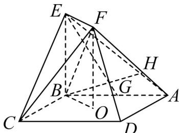

<!-- question-source:start -->
26. (2016·天津·高考真题) 如图, 正方形 $ABCD$ 的中心为 $O$ , 四边形 $OBEF$ 为矩形, 平面 $OBEF \perp$ 平面 $ABCD$ , 点 $G$ 为 $AB$ 的中点, $AB=BE=2$ .

(Ⅰ) 求证：EGⅡ平面 ADF；

(Ⅱ) 求二面角 O-EF-C 的正弦值；

（III）设 $^{H}$ 为线段 $^{AF}$ 上的点，且 $AH=\frac{2}{3}HF$ ，求直线 $^{BH}$ 和平面 $^{CEF}$ 所成角的正弦值.
<!-- question-source:end -->

![[高中/真题/按题型分类/专题21 立体几何大题综合/考点06_求线面角及最值或范围/真题/answers/Q00035918A1.md]]
