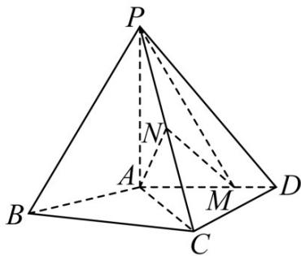

<!-- question-source:start -->
27．（2016·全国·高考真题）如图，四棱锥 P-ABCD 中， $PA^{\perp}$ 底面 ABCD， $AD^{\parallel}BC$ ， $AB=AD=AC=3$ ， $PA=BC=4$ ，M 为线段 AD 上一点， $AM=2MD$ ，N 为 PC 的中点·

(Ⅰ) 证明 $MN^{\parallel}$ 平面 $PAB$ ;

(Ⅱ) 求直线 AN 与平面 PMN 所成角的正弦值.
<!-- question-source:end -->

![[高中/真题/按题型分类/专题21 立体几何大题综合/考点06_求线面角及最值或范围/真题/answers/Q00035919A1.md]]
