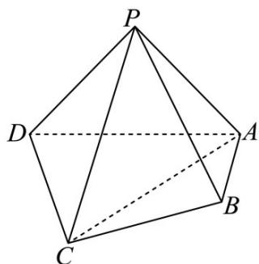

<!-- question-source:start -->
28．（2016·北京·高考真题）如图，在四棱锥 P-ABCD 中，平面 PAD⊥平面 ABCD，PA⊥PD，PA=PD， $AB \perp AD$ ，AB = 1，AD = 2，AC = CD = $\sqrt{5}$ .

(1) 求证： $PD \perp$ 平面 PAB；

(2) 求直线 PA 与平面 PCD 所成角的正弦值；

(3) 在棱 $PA$ 上是否存在点 $M$ ，使得 $BM //$ 平面 $PCD$ ？若存在，求 $\frac{AM}{AP}$ 的值；若不存在，说明理由
<!-- question-source:end -->

![[高中/真题/按题型分类/专题21 立体几何大题综合/考点06_求线面角及最值或范围/真题/answers/Q00035920A1.md]]
