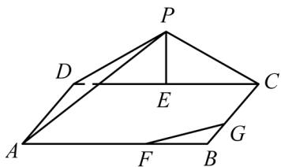

<!-- question-source:start -->
30．（2015·广东·高考真题）如图，三角形△PDC所在的平面与长方形ABCD所在的平面垂直，PD=PC=4，AB=6，BC=3，点E是CD的中点，点F、G分别在线段AB、BC上，且AF=2FB，CG=2GB.

(1) 证明： $PE_{\perp}FG$ ;

(2) 求二面角 PAD.C 的正切值；

(3) 求直线 $PA$ 与直线 $FG$ 所成角的余弦值.

<!-- question-source:end -->

![[高中/真题/按题型分类/专题21 立体几何大题综合/考点06_求线面角及最值或范围/真题/answers/Q00035922A1.md]]
