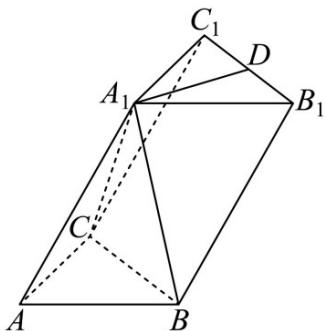

<!-- question-source:start -->
31．（2015·浙江·高考真题）如图，在三棱锥 $ABC-A_{1}B_{1}C_{1}$ 中， $\angle BAC=90^{\circ}$ ，AB=AC=2, $AA_{1}=4,A_{1}$ 在底

面 ABC 的射影为 BC 的中点，D 为 $B_{1}C_{1}$ 的中点.

<!-- question-source:end -->

![[高中/真题/按题型分类/专题21 立体几何大题综合/考点06_求线面角及最值或范围/真题/answers/Q00035923A1.md]]
