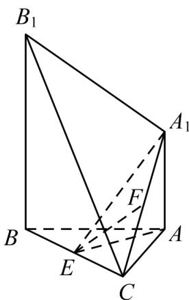

<!-- question-source:start -->
32. (2015·天津·高考真题) 如图, 已知 $AA_{1} \perp$ 平面 ABC, $BB_{1} \parallel AA_{1}$ , AB=AC=3, BC=2 $\sqrt{5}$ , $AA_{1}=\sqrt{7}$ , $BB_{1}=2\sqrt{7}$ . 点 E,F 分别是 BC, $A_{1}B_{1}$ 的中点.

(Ⅰ) 求证: $EF \parallel$ 平面 $A_{1}B_{1}BA$ ;

(Ⅱ) 求证: 平面 $AEA_{1} \perp$ 平面 $BCB_{1}$ .

(III) 求直线 $A_{1}B_{1}$ 与平面 $BCB_{1}$ 所成角的大小.
<!-- question-source:end -->

![[高中/真题/按题型分类/专题21 立体几何大题综合/考点06_求线面角及最值或范围/真题/answers/Q00035924A1.md]]
