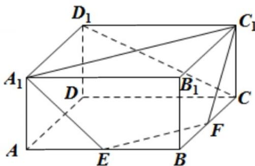

<!-- question-source:start -->
33. (2015·上海·高考真题) 如图, 在长方体 $\mathrm{ABCD - A_1B_1C_1D_1}$ 中, $\mathrm{AA}_1 = 1$ , $\mathrm{AB} = \mathrm{AD} = 2$ , E、F分别是

AB、BC的中点．证明 $\mathrm{A}_{1}$ 、 $\mathrm{C}_{1}$ 、F、E四点共面，并求直线 $\mathrm{CD}_{1}$ 与平面 $\mathrm{A}_{1}\mathrm{C}_{1}\mathrm{FE}$ 所成的角的大小.

<!-- question-source:end -->

![[高中/真题/按题型分类/专题21 立体几何大题综合/考点06_求线面角及最值或范围/真题/answers/Q00035925A1.md]]
