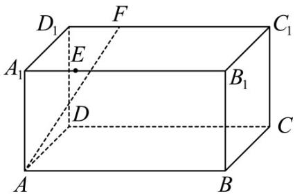

<!-- question-source:start -->
34．（2015·全国·高考真题）如图，长方体 $ABCD - A_1B_1C_1D_1$ 中， $AB = 16$ ， $BC = 10$ ， $AA_{1} = 8$ ，点 $E$ ， $F$ 分别在 $A_{1}B_{1}$ ， $C_{1}D_{1}$ 上， $A_{1}E = D_{1}F = 4$ 。过点 $E$ ， $F$ 的平面 $\alpha$ 与此长方体的面相交，交线围成一个正方形。

(Ⅰ) 在图中画出这个正方形（不必说出画法和理由）；

(Ⅱ) 求直线 AF 与平面 $\alpha$ 所成角的正弦值.
<!-- question-source:end -->

![[高中/真题/按题型分类/专题21 立体几何大题综合/考点06_求线面角及最值或范围/真题/answers/Q00035926A1.md]]
