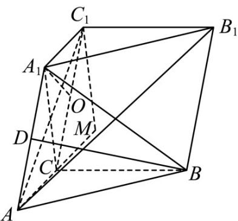

> [!faq]- 《专题21 立体几何大题综合》真题解析
>
> > [!success]- **【答案】** 详见解析
>
> > [!note]- **【分析】**
> > 【分析】（1）根据线面垂直，面面垂直的判定与性质定理可得 $A_{1}O \perp$ 平面 $BCC_{1}B_{1}$ ，再由勾股定理求出 $O$ 为中点，即可得证；
> >
> > (2) 利用直角三角形求出 $AB_{1}$ 的长及点 A 到面的距离，根据线面角定义直接可得正弦值
>
> > [!note]- **【解析】**
> > 【详解】（1）如图，
> > 
> > 底面，面
> > $\because A_{1}C \perp ABC \quad BC \subset ABC$
> > $\therefore A_{1}C \perp BC$ ，又 $BC \perp AC$ ， $A_{1}C, AC \subset$ 平面 $ACC_{1}A_{1}$ ， $A_{1}C \cap AC = C$
> > $\therefore BC \perp$ 平面 $ACC_{1}A_{1}$ ，又 $BC \subset$ 平面 $BCC_{1}B_{1}$
> > ∴平面 $ACC_{1}A_{1} \perp$ 平面 $BCC_{1}B_{1}$
> > 过 $A_{1}$ 作 $A_{1}O \perp CC_{1}$ 交 $CC_{1}$ 于 $O$ ，又平面 $ACC_{1}A_{1} \cap$ 平面 $BCC_{1}B_{1} = CC_{1}$ ， $A_{1}O \subset$ 平面 $ACC_{1}A_{1}$
> > $\therefore A_{1}O \perp$ 平面 $BCC_{1}B_{1}$
> > ∵ $A_{1}$ 到平面 $BCC_{1}B_{1}$ 的距离为 1，∴ $A_{1}O = 1$
> > 在 $\mathrm{Rt}^{\triangle}A_{1}CC_{1}$ 中， $A_{1}C\perp A_{1}C_{1},CC_{1} = AA_{1} = 2$
> > 设 $CO = x$ ，则 $C_1O = 2 - x$
> > $\because \triangle A_{1}OC, \triangle A_{1}OC_{1}, \triangle A_{1}CC_{1}$ 为直角三角形，且 $CC_{1} = 2$
> > $CO^{2} + A_{1}O^{2} = A_{1}C^{2}$ ， $A_{1}O^{2} + OC_{1}^{2} = C_{1}A_{1}^{2}$ ， $A_{1}C^{2} + A_{1}C_{1}^{2} = C_{1}C^{2}$
> > $\therefore 1 + x^{2} + 1 + (2 - x)^{2} = 4$ ，解得 x = 1，
> > $\therefore AC = A_{1}C = A_{1}C_{1} = \sqrt{2}$
> > $\therefore A_{1}C = AC$
> > (2) $\because AC = A_{1}C_{1}, BC \perp A_{1}C, BC \perp AC$
> > $\therefore \mathrm{Rt}^{\triangle}ACB \cong \mathrm{Rt}^{\triangle}A_{1}CB$
> > $$
> > \therefore B A = B A _ {1}
> > $$
> > 过 B 作 $BD \perp AA_{1}$ ，交 $AA_{1}$ 于 D，则 D 为 $AA_{1}$ 中点，
> > 由直线 $AA_{1}$ 与 $BB_{1}$ 距离为 2，所以 BD = 2
> > $\because A_{1}D = 1, BD = 2, \therefore A_{1}B = AB = \sqrt{5}$
> > 在 Rt△ ABC ，∴ $BC = \sqrt{AB^{2} - AC^{2}} = \sqrt{3}$
> > 延长 $AC$ ，使 $AC = CM$ ，连接 $C_1M$
> > 由 $CM \parallel A_{1}C_{1}, CM = A_{1}C_{1}$ 知四边形 $A_{1}CMC_{1}$ 为平行四边形，
> > $\therefore C_{1}M \parallel A_{1}C, \therefore C_{1}M \perp$ 平面 $ABC$ ，又 $AM \subset$ 平面 $ABC$
> > $$
> > \therefore C _ {1} M \perp A M
> > $$
> > 则在 $\mathrm{Rt}^{\triangle}AC_{1}M$ 中， $AM = 2AC,C_1M = A_1C$ ， $\therefore AC_1 = \sqrt{(2AC)^2 + A_1C^2}$
> > 在 $\mathrm{Rt}\triangle AB_1C_1$ 中， $AC_{1} = \sqrt{(2AC)^{2} + A_{1}C^{2}}$ ， $B_{1}C_{1} = BC = \sqrt{3}$
> > $\therefore AB_{1} = \sqrt{(2\sqrt{2})^{2} + (\sqrt{2})^{2} + (\sqrt{3})^{2}} = \sqrt{13}$
> > 又 A 到平面 $BCC_{1}B_{1}$ 距离也为 1，
> > 所以 $AB_{1}$ 与平面 $BCC_{1}B_{1}$ 所成角的正弦值为 $\frac{1}{\sqrt{13}} = \frac{\sqrt{13}}{13}$ .
