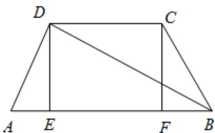
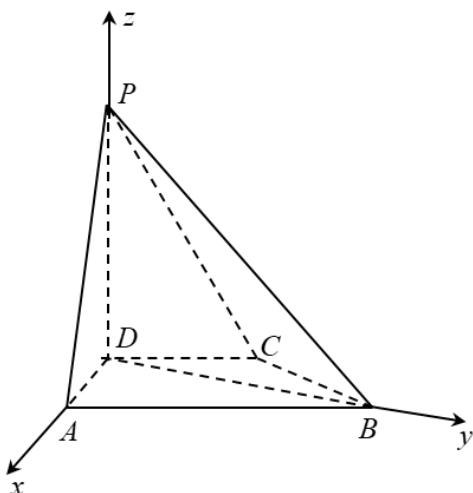

> [!faq]- 《专题21 立体几何大题综合》真题解析
>
> > [!success]- **【答案】** 详见解析
>
> > [!note]- **【分析】**
> > 【分析】（1）作 $DE \perp AB$ 于 $E$ ， $CF \perp AB$ 于 $F$ ，利用勾股定理证明 $AD \perp BD$ ，根据线面垂直的性质可得 $PD \perp BD$ ，从而可得 $BD \perp$ 平面 $PAD$ ，再根据线面垂直的性质即可得证；
> >
> > (2) 以点 D 为原点建立空间直角坐标系，利用向量法即可得出答案.
>
> > [!note]- **【解析】**
> > 【详解】（1）证明：在四边形ABCD中，作 $DE \perp AB$ 于E， $CF \perp AB$ 于F，
> > 因为 $CD / / AB, AD = CD = CB = 1, AB = 2$
> > 所以四边形 ABCD 为等腰梯形，
> > 所以 $AE = BF = \frac{1}{2}$
> > 故 $DE = \frac{\sqrt{3}}{2}$ ， $BD = \sqrt{DE^2 + BE^2} = \sqrt{3}$
> > 所以 $AD^{2} + BD^{2} = AB^{2}$
> > 所以 $AD \perp BD$
> > 因为 $PD \perp$ 平面 ABCD ， $BD \subset$ 平面 ABCD ，
> > 所以 $PD \perp BD$ ，
> > 又 $PD \cap AD = D$
> > 所以 $BD \perp$ 平面 PAD ，
> > 又因为 $PA \subset$ 平面 PAD ，
> > 所以 $BD \perp PA$ ;
> > 
> > (2) 解：如图，以点 D 为原点建立空间直角坐标系， $BD = \sqrt{3}$
> > 则 $A(1,0,0), B(0,\sqrt{3},0), P(0,0,\sqrt{3})$
> > 则 $\overline{AP} = (-1,0,\sqrt{3}),\overline{BP} = (0,-\sqrt{3},\sqrt{3}),\overline{DP} = (0,0,\sqrt{3})$
> > 设平面 $PAB$ 的法向量 $n = (x, y, z)$
> > 则有 $\left\{ \begin{array}{l} n \cdot AP = -x + \sqrt{3}z = 0 \\ n \cdot BP = -\sqrt{3}y + \sqrt{3}z = 0 \end{array} \right.$ ，可取 $n = (\sqrt{3}, 1, 1)$ ，
> > 则 $\cos\left\langle n,DP\right\rangle=\frac{n\cdot DP}{\left|n\right|\left|DP\right|}=\frac{\sqrt{5}}{5}$
> > 所以 $PD$ 与平面 $PAB$ 所成角的正弦值为 $\frac{\sqrt{5}}{5}$
> > 
