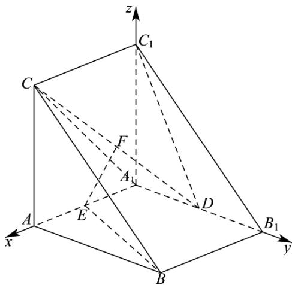

> [!faq]- 《专题21 立体几何大题综合》真题解析
>
> > [!success]- **【答案】** 详见解析
>
> > [!note]- **【分析】**
> > （1）以点 $A_{1}$ 为坐标原点， $A_{1}A$ 、 $A_{1}B_{1}$ 、 $A_{1}C_{1}$ 所在直线分别为 $x$ 、 $y$ 、 $z$ 轴建立空间直角坐标系，利用空间向量法可证得结论成立；
> >
> > (2) 利用空间向量法可求得直线 BE 与平面 $CC_{1}D$ 夹角的正弦值；
> >
> > (3) 利用空间向量法可求得平面 $A_{1}CD$ 与平面 $CC_{1}D$ 夹角的余弦值.
>
> > [!note]- **【解析】**
> > （1）证明：在直三棱柱 $ABC-A_{1}B_{1}C_{1}$ 中， $AA_{1}\perp$ 平面 $A_{1}B_{1}C_{1}$ ，且 $AC\perp AB$ ，则 $A_{1}C_{1}\perp A_{1}B_{1}$
> > 以点 $A_{1}$ 为坐标原点， $A_{1}A$ 、 $A_{1}B_{1}$ 、 $A_{1}C_{1}$ 所在直线分别为 $x$ 、 $y$ 、 $z$ 轴建立如下图所示的空间直角坐标系，
> > 
> > 则 $A(2,0,0)$ 、 $B(2,2,0)$ 、 $C(2,0,2)$ 、 $A_{1}(0,0,0)$ 、 $B_{1}(0,2,0)$ 、 $C_{1}(0,0,2)$ 、 $D(0,1,0)$ 、 $E(1,0,0)$ 、 $F\left(1,\frac{1}{2},1\right)$ ，
> > 则 $EF = \left(0, \frac{1}{2}, 1\right)$ ,
> > 易知平面 ABC 的一个法向量为 $m = (1, 0, 0)$ ，则 $EF \cdot m = 0$ ，故 $EF \perp m$ ，
> > ∵ EF ∉ 平面 ABC，故 $EF \parallel$ 平面 ABC.
> > (2) 解： $C_{1}C=\left(2,0,0\right)$ ， $C_{1}D=\left(0,1,-2\right)$ ， $EB=\left(1,2,0\right)$
> > 设平面 $CC_{1}D$ 的法向量为 $u = (x_{1},y_{1},z_{1})$ ，则 $\left\{ \begin{array}{ll}u\cdot C_{1}C = 2x_{1} = 0\\ u\cdot C_{1}D = y_{1} - 2z_{1} = 0 \end{array} \right.$
> > 取 $y_{1} = 2$ ，可得 $u = (0,2,1)$ ， $\cos < \overrightarrow{EB}, u > = \frac{\overrightarrow{EB} \cdot u}{|\overrightarrow{EB}| \cdot |u|} = \frac{4}{5}$ .
> > 因此，直线 $_{BE}$ 与平面 $CC_{1}D$ 夹角的正弦值为 $\frac{4}{5}$
> > (3) 解： $A_{1}C = (2,0,2)$ ， $A_{1}D = (0,1,0)$
> > 设平面 $A_{1}CD$ 的法向量为 $v = (x_{2},y_{2},z_{2})$ ，则 $\left\{ \begin{array}{l} \overline{\nu}\cdot \overline{A} C = 2x_2 + 2z_2 = 0 \\ \overline{\nu}\cdot A_1D = y_2 = 0 \end{array} \right.$
> > 取 $x_{2} = 1$ ，可得 $v = (1,0, - 1)$ ，则 $\cos < u,v > = \frac{u\cdot v}{|u|\cdot|v|} = -\frac{1}{\sqrt{5}\times\sqrt{2}} = -\frac{\sqrt{10}}{10}$
> > 因此，平面 $A_{1}CD$ 与平面 $CC_{1}D$ 夹角的余弦值为 $\frac{\sqrt{10}}{10}$ .
