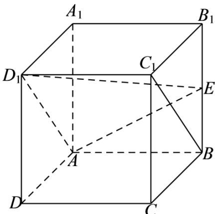
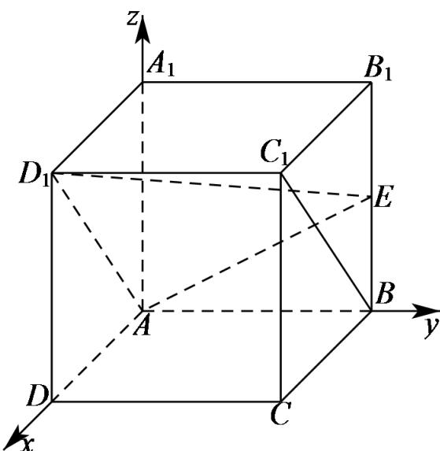
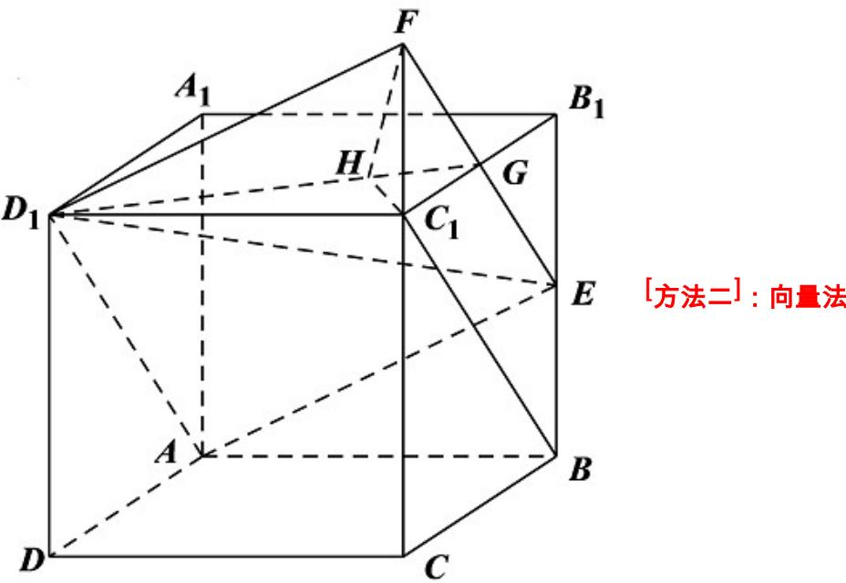
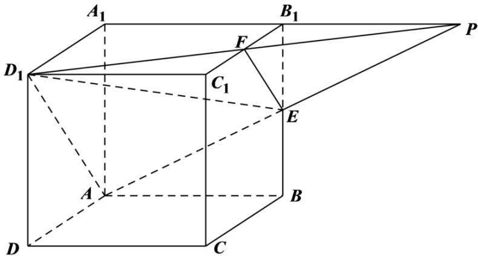

> [!faq]- 《专题21 立体几何大题综合》真题解析
>
> > [!success]- **【答案】** （Ⅰ）证明见解析；（Ⅱ） $\frac{2}{3}$
>
> > [!note]- **【分析】**
> > （Ⅰ）证明出四边形 $ABC_{1}D_{1}$ 为平行四边形，可得出 $BC_{1}//AD_{1}$ ，然后利用线面平行的判定定理可证得结论；也可利用空间向量计算证明；
> >
> > （Ⅱ）可以将平面扩展，将线面角转化，利用几何方法作出线面角，然后计算；也可以建立空间直角坐标系，利用空间向量计算求解。
>
> > [!note]- **【解析】**
> > （Ⅰ）[方法一]：几何法
> > 如下图所示：
> > 
> > 在正方体 $ABCD - A_1B_1C_1D_1$ 中， $AB // A_1B_1$ 且 $AB = A_1B_1$ ， $A_1B_1 // C_1D_1$ 且 $A_1B_1 = C_1D_1$ $\therefore AB // C_1D_1$ 且 $AB = C_1D_1$ ，所以，四边形 $ABC_1D_1$ 为平行四边形，则 $BC_1 // AD_1$ ， $\because BC_1 \notin$ 平面 $AD_1E$ ， $AD_1 \subset$ 平面 $AD_1E$ ， $\therefore BC_1 //$ 平面 $AD_1E$ ；
> > [方法二]: 空间向量坐标法
> > 以点A为坐标原点，AD、AB、 $AA_{1}$ 所在直线分别为x、y、z轴建立如下图所示的空间直角坐标系A-xyz
> > 
> > 设正方体 $ABCD - A_{1}B_{1}C_{1}D_{1}$ 的棱长为 2，则 $A(0,0,0)$ 、 $A_{1}(0,0,2)$ 、 $D_{1}(2,0,2)$ 、 $E(0,2,1)$ ， $AD_{1} = (2,0,2)$ ， $AE = (0,2,1)$
> > 设平面 $AD_{1}E$ 的法向量为 $n = (x,y,z)$ ，由 $\left\{ \begin{array}{l} n \cdot AD_{1} = 0 \\ \rightarrow \square \square \\ n \cdot AE = 0 \end{array} \right.$ ，得 $\left\{ \begin{array}{l} 2x + 2z = 0 \\ 2y + z = 0 \end{array} \right.$
> > 令 z = -2 ，则 x = 2 ，y = 1 ，则 $n = (2, 1, -2)$ .
> > 又∵向量 $\overline{BC_{1}}=(2,0,2)$ , $\overline{BC_{1}}\cdot n=2\times2+0\times1+2\times(-2)=0$ ,
> > 又∵ $BC_{1} \not\subset$ 平面 $AD_{1}E$ ，∴ $BC_{1} //$ 平面 $AD_{1}E$ ；
> > (Ⅱ) [方法一]：几何法
> > 延长 $CC_{1}$ 到F，使得 $C_{1}F=BE$ ，连接EF，交 $B_{1}C_{1}$ 于G，
> > 又： $C_{1}F // BE$ ，∴四边形 $BEFC_{1}$ 为平行四边形，∴ $BC_{1} // EF$ ，
> > 又∵ $BC_{1}//AD_{1},\therefore AD_{1}//EF$ ，所以平面 $AD_{1}E$ 即平面 $AD_{1}FE$ ，
> > 连接 $D_{1}G$ ，作 $C_{1}H\perp D_{1}G$ ，垂足为H，连接FH，
> > $\therefore FC_{1} \perp$ 平面 $A_{1}B_{1}C_{1}D_{1}, D_{1}G \subset$ 平面 $A_{1}B_{1}C_{1}D_{1}, \therefore FC_{1} \perp D_{1}G$
> > 又∵ $FC_{1}\cap C_{1}H=C_{1},\therefore$ 直线 $D_{1}G\perp$ 平面 $C_{1}FH,$
> > 又: 直线 $D_{1}G \subset$ 平面 $D_{1}GF, \therefore$ 平面 $D_{1}GF \perp$ 平面 $C_{1}FH,$
> > ∴ $C_{1}$ 在平面 $D_{1}GF$ 中的射影在直线 FH 上∵ 直线 FH 为直线 $FC_{1}$ 在平面 $D_{1}GF$ 中的射影， $\angle C_{1}FH$ 为直线 $FC_{1}$ 与平面 $D_{1}GF$ 所成的角，
> > 根据直线 $FC_{1}$ // 直线 $AA_{1}$ ，可知 $C_{1}FH$ 为直线 $AA_{1}$ 与平面 $AD_{1}G$ 所成的角.
> > 设正方体的棱长为 $^{2}$ ，则 $C_{1}G = C_{1}F = 1, D_{1}G = \sqrt{5}, \therefore C_{1}H = \frac{2 \times 1}{\sqrt{5}} = \frac{2}{\sqrt{5}}$
> > $$
> > \therefore F H = \sqrt {1 + \left(\frac {2}{\sqrt {5}}\right) ^ {2}} = \frac {3}{\sqrt {5}}
> > $$
> > $\therefore \sin \angle C_{1}FH = \frac{C_{1}H}{FH} = \frac{2}{3},$
> > 即直线 $AA_{1}$ 与平面 $AD_{1}E$ 所成角的正弦值为 $\frac{2}{3}$ .
> > 
> > 接续（1）的向量方法，求得平面平面 $AD_{1}E$ 的法向量 $n = (2,1, - 2)$
> > 又∵ $\overrightarrow{AA_{1}}=\left(0,0,2\right)$ ，∴ $\cos<n,\overrightarrow{AA_{1}}>=\frac{n\cdot\overrightarrow{AA_{1}}}{\left|n\right|\cdot\left|AA_{1}\right|}=-\frac{4}{3\times2}=-\frac{2}{3}$
> > ∴直线 $AA_{1}$ 与平面 $AD_{1}E$ 所成角的正弦值为 $\frac{2}{3}$
> > [方法三]：几何法 $^{+}$ 体积法
> > 如图，设 $B_{1}C_{1}$ 的中点为 $F$ ，延长 $A_{1}B_{1},AE,D_{1}F$ ，易证三线交于一点 $P$
> > 因为 $BB_{1}\parallel AA_{1},EF\parallel AD_{1}$
> > 所以直线 $AA_{1}$ 与平面 $AD_{1}E$ 所成的角，即直线 $B_{1}E$ 与平面PEF所成的角.
> > 设正方体的棱长为 $^{2}$ ，在！PEF 中，易得 $PE = PF = \sqrt{5}, EF = \sqrt{2}$
> > 可得 $S_{\triangle PEF} = \frac{3}{2}$
> > 由 $V_{\text{三棱锥}B_1 - PEF} = V_{\text{三棱锥}P - B_1EF}$ ，得 $\frac{1}{3} \times \frac{3}{2} \cdot B_1H = \frac{1}{3} \times \frac{1}{2} \times 1 \times 1 \times 2$
> > 整理得 $B_{1}H = \frac{2}{3}$
> > 所以 $\sin\angle B_{1}EH=\frac{B_{1}H}{B_{1}E}=\frac{2}{3}$
> > 所以直线 $AA_{1}$ 与平面 $AD_{1}E$ 所成角的正弦值为 $\frac{2}{3}$
> > 
> > [方法四]：纯体积法
> > 设正方体的棱长为 $^{2}$ ，点 $A_{1}$ 到平面 $AED_{1}$ 的距离为 h，
> > 在 $\triangle AED_{1}$ 中， $AE = \sqrt{5},AD_{1} = 2\sqrt{2},D_{1}E = 3$
> > $\cos \angle AED_{1} = \frac{D_{1}E^{2} + AE^{2} - AD_{1}^{2}}{2D_{1}E\cdot AE} = \frac{9 + 5 - 8}{2\times3\times\sqrt{5}} = \frac{\sqrt{5}}{5}$
> > 所以 $\sin\angle AED_{1}=\frac{2\sqrt{5}}{5}$ ，易得 $S_{\triangle AED_{1}}=3$
> > 由 $V_{E - AA_1D_1} = V_{A_1 - AED_1}$ ，得 $\frac{1}{3} S_{\triangle AD_1A_1}\cdot A_1B_1 = \frac{1}{3} S_{\triangle AED_1}\cdot h$ ，解得 $h = \frac{4}{3}$
> > 设直线 $AA_{1}$ 与平面 $AED_{1}$ 所成的角为 $\theta$ ，所以 $\sin \theta = \frac{h}{AA_1} = \frac{2}{3}$
> > 【整体点评】（Ⅰ）的方法一使用线面平行的判定定理证明，方法二使用空间向量坐标运算进行证明；
> > (Ⅱ) 第一种方法中使用纯几何方法，适合于没有学习空间向量之前的方法，有利用培养学生的集合论证和空间想象能力，第二种方法使用空间向量方法，两小题前后连贯，利用计算论证和求解，定为最优解法；方法三在几何法的基础上综合使用体积方法，计算较为简洁；方法四不作任何辅助线，仅利用正余弦定理和体积公式进行计算，省却了辅助线和几何的论证，不失为一种优美的方法。
