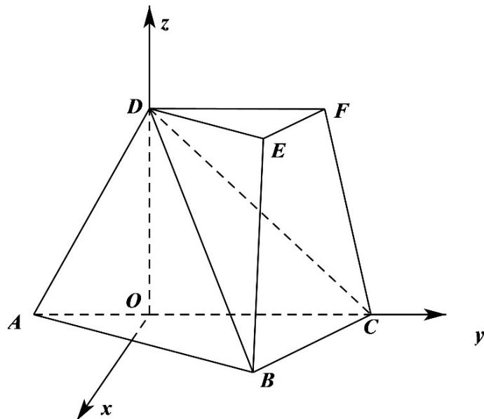
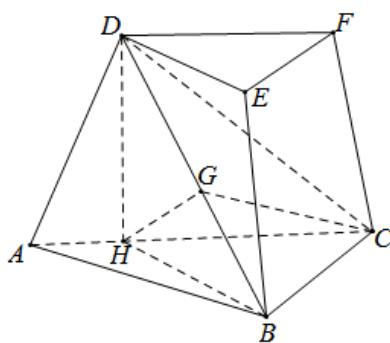
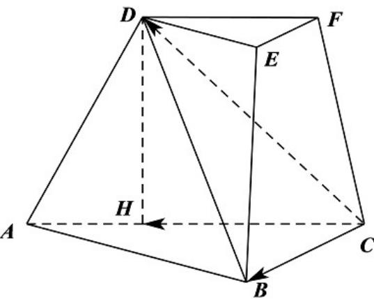

> [!faq]- 《专题21 立体几何大题综合》真题解析
>
> > [!success]- **【答案】** 详见解析
>
> > [!note]- **【分析】**
> > 【分析】（I）方法一：作 $DH \perp AC$ 交 $AC$ 于 $H$ ，连接 $BH$ ，由题意可知 $DH \perp$ 平面 $ABC$ ，即有 $DH \perp BC$ 根据勾股定理可证得 $BC \perp BH$ ，又 $EF // BC$ ，可得 $DH \perp EF$ ， $BH \perp EF$ ，即得 $EF \perp$ 平面 $BHD$ ，即证得 $EF \perp DB$ ；
> >
> > (Ⅱ) 方法一：由 $DF // CH$ ，所以 $DF$ 与平面 $DBC$ 所成角即为 $CH$ 与平面 $DBC$ 所成角，作 $HG \perp BD$ 于 $G$ ，连接 $CG$ ，即可知 $\angle HCG$ 即为所求角，再解三角形即可求出 $DF$ 与平面 $DBC$ 所成角的正弦值。
>
> > [!note]- **【解析】**
> > 【详解】（Ⅰ）[方法一]：几何证法
> > 作 $DH \perp AC$ 交 AC 于 H ，连接 BH .
> > ∵平面 $ADFC \perp$ 平面 ABC ，而平面 $ADFC \cap$ 平面 ABC = AC ，DH ⊂ 平面 ADFC
> > ∴ $DH \perp$ 平面 ABC ，而 $BC \subset$ 平面 ABC ，即有 $DH \perp BC$
> > $$
> > \because \angle A C B = \angle A C D = 4 5 ^ {\circ}
> > $$
> > $$
> > \therefore C D = \sqrt {2} C H = 2 B C \Rightarrow C H = \sqrt {2} B C
> > $$
> > 在 $\triangle CBH$ 中， $BH^{2} = CH^{2} + BC^{2} - 2CH\cdot BC\cos 45^{\circ} = BC^{2}$ ，即有 $BH^{2} + BC^{2} = CH^{2}$ ， $\therefore BH \perp BC$
> > 由棱台的定义可知， $EF \parallel BC$ ，所以 $DH \perp EF$ ， $BH \perp EF$ ，而 $BH \cap DH = H$ ，
> > ∴ EF ⊥ 平面 BHD，而 BD ⊂ 平面 BHD，∴ EF ⊥ DB
> > [方法二]【最优解】：空间向量坐标系方法
> > 作 $DO \perp AC$ 交AC于O.
> > ∵平面 $ADFC \perp$ 平面 ABC ，而平面 $ADFC \cap$ 平面 ABC = AC ，DO ⊂ 平面 ADFC
> > $\therefore DO \perp$ 平面 ABC，以 O 为原点，建立空间直角坐标系如图所示
> > 设 $OC = 1, \because \angle ACB = \angle ACD = 45^{\circ}$ ， $DC = 2BC = \sqrt{2}$
> > $$
> > \therefore B C = \frac {\sqrt {2}}{2}, \therefore D (0, 0, 1), C (0, 1, 0), B \left(\frac {1}{2}, \frac {1}{2}, 0\right)
> > $$
> > $$
> > \therefore \stackrel {\square \square \square} {B D} = \left(- \frac {1}{2}, - \frac {1}{2}, 1\right), \stackrel {\square \square \square} {B C} = \left(- \frac {1}{2}, \frac {1}{2}, 0\right),
> > $$
> > $BD \cdot BC = \frac{1}{4} - \frac{1}{4} = 0,$
> > $\therefore BC\perp BD,$ 又 $\because$ 棱台中 $BC//EF,\therefore EF\perp BD;$
> > 
> > [方法三]：三余弦定理法
> > ∵平面 $ACFD \perp$ 平面 ABC，∴ $\cos\angle BCD = \cos\angle ACB\cos\angle ACD = \cos45^{\circ}\cos45^{\circ} = \frac{1}{2}$
> > $\therefore \angle BCD = 60^{\circ}$
> > 又∵DC=2BC.
> > $\therefore \angle CBD = 90^{\circ}$ ，即 $CB \perp BD$ ，
> > 又∵EF//BC，∴EF⊥DB。
> > (Ⅱ) [方法一]：几何法
> > 因为 $DF \parallel CH$ ，所以 $DF$ 与平面 $DBC$ 所成角即为与 $CH$ 平面 $DBC$ 所成角.
> > 作 $HG \perp BD$ 于 $G$ ，连接 $CG$ ，由（1）可知， $BC \perp$ 平面 $BHD$
> > 因为所以平面 $BCD \perp$ 平面 BHD ，而平面 $BCD \cap$ 平面 BHD = BD ，
> > $HG \subset$ 平面 BHD，∴ $HG \perp$ 平面 BCD
> > 即 $CH$ 在平面 $DBC$ 内的射影为 $CG$ ， $\angle HCG$ 即为所求角．
> > 在 $Rt^{\triangle}HGC$ 中，设 $BC = a$ ，则 $CH = \sqrt{2} a$ ， $HG = \frac{BH\cdot DH}{BD} = \frac{\sqrt{2}a\cdot a}{\sqrt{3}a} = \frac{\sqrt{2}}{\sqrt{3}} a$
> > $\therefore \sin \angle HCG = \frac{HG}{CH} = \frac{1}{\sqrt{3}} = \frac{\sqrt{3}}{3}$
> > 故 $_{DF}$ 与平面 $_{DBC}$ 所成角的正弦值为 $\frac{\sqrt{3}}{3}$
> > 
> > [方法二]【最优解】：空间向量坐标系法
> > 设平面 BCD 的法向量为 $n = (x, y, z)$ ,
> > 由（I）得 $\overline{BD} = \left(-\frac{1}{2}, -\frac{1}{2}, 1\right), \overline{BC} = \left(-\frac{1}{2}, \frac{1}{2}, 0\right)$ ，
> > $\therefore \left\{ \begin{array}{l} -\frac{1}{2} x - \frac{1}{2} y + z = 0 \\ -\frac{1}{2} x + \frac{1}{2} y = 0 \end{array} \right.$ ，令则，，，，， $n = (1,1,1)$
> > $\overrightarrow{OC} = (0,1,0)$ , $\cos n, OC = \frac{1}{\sqrt{1+1+1}\cdot1} = \frac{\sqrt{3}}{3}$ ,
> > 由于 $DF / / OC$ ，∴直线 $DF$ 与平面 $DBC$ 所成角的正弦值为 $\frac{\sqrt{3}}{3}$
> > [方法三]：空间向量法
> > 以 $\{CH, CB, CD\}$ 为基底，
> > 
> > 不妨设 $DC = 2BC = 2$ ，则
> > $DB = \sqrt{3}, CH = \sqrt{2}, \angle HCB = 45^{\circ}, \angle HCD = 45^{\circ}, \angle DCB = 60^{\circ}$ （由（I）的结论可得）.
> > 设平面 DBC 的法向量为 $n = xCH + yCB + zCD$
> > 则由 $\left\{\begin{aligned}n\cdot\stackrel{\square\square}{\longrightarrow}CD&=0,\\ n\cdot CB&=0,\end{aligned}\right.$ 得 $\left\{\begin{aligned}2x+y+4z&=0,\\ x+y+z&=0,\end{aligned}\right.$ 取 $z=1$ ，得 $n=-3CH+2CB+CD$
> > 设直线 $DF$ 与平面 $DBC$ 所成角为 $\theta$
> > 则直线 HC 与平面 DBC 所成角也为 $\theta$ ，
> > 由公式得 $\sin \theta = \frac{|\overline{H} C \cdot n|}{|HC||n|} = \frac{2}{\sqrt{2} \cdot \sqrt{6}} = \frac{\sqrt{3}}{3}$ .
> > [方法四]：三余弦定理法
> > 由 $\angle ACB = \angle ACD = 45^{\circ}$
> > 可知 $H$ 在平面 $DBC$ 的射影 $G$ 在 $\angle DCB$ 的角平分线上.
> > 设直线 $DF$ 与平面 $DBC$ 所成角为 $\theta$ ，则 $HC$ 与平面 $DBC$ 所成角也为 $\theta$
> > 由由（I）的结论可得 $\angle BCD = 60^{\circ}$
> > 由三余弦定理，得 $\cos 45^{\circ} = \cos 30^{\circ}\cdot \cos \theta$
> > $\cos \theta = \frac{\sqrt{6}}{3}$ 从而 $\sin \theta = \frac{\sqrt{3}}{3}$
> > [方法五]：等体积法
> > 设 H 到平面 DBC 的距离为 h，
> > 设 DH = 1，则 $HC = 1, DC = \sqrt{2}, BC = \frac{\sqrt{2}}{2}, BD = \frac{\sqrt{6}}{2}$ ,
> > 设直线 $DF$ 与平面 $DBC$ 所成角为 $\theta$ ，由已知得 $HC$ 与平面 $DBC$ 所成角也为 $\theta$ 。
> > $$
> > V _ {H - D B C} = V _ {D - H B C}, \frac {1}{3} \times \frac {1}{2} \times \sqrt {2} \times \frac {\sqrt {2}}{2} \sin 6 0 ^ {\circ} \times h = \frac {1}{3} \times \frac {1}{2} \times 1 \times \frac {\sqrt {2}}{2} \sin 4 5 ^ {\circ} \times 1,
> > $$
> > 求得 $h = \frac{\sqrt{3}}{3}$ ，所以 $\sin \theta = \frac{h}{HC} = \frac{\frac{\sqrt{3}}{3}}{1} = \frac{\sqrt{3}}{3}$
> > 【整体评价】（Ⅰ）的方法一使用几何方法证明，方法二利用空间直角坐标系方法，简洁清晰，通性通法，确定为最优解；方法三使用了两垂直角的三余弦定理得到 $\angle BCD = 60^{\circ}$ ，进而证明，过程简洁，确定为最优解（Ⅱ）的方法一使用几何做法，方法二使用空间坐标系方法，为通性通法，确定为最优解；方法三使用空间向量的做法，避开了辅助线的求作；方法四使用三余弦定理法，最为简洁，确定为最优解；方法五采用等体积转化法，避免了较复杂的辅助线。
