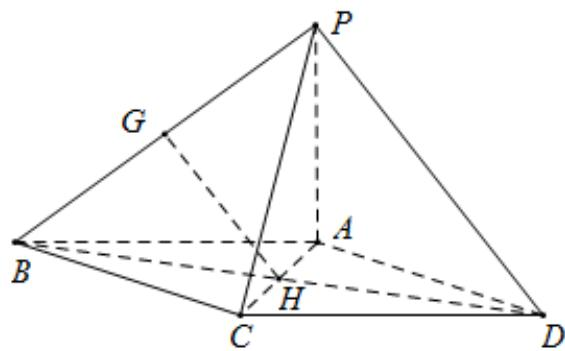
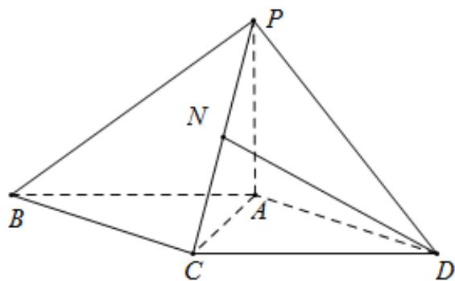
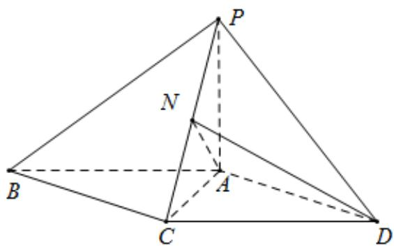

> [!faq]- 《专题21 立体几何大题综合》真题解析
>
> > [!success]- **【答案】** 详见解析
>
> > [!note]- **【分析】**
> > 【分析】（1）连接 $BD$ ，结合平行四边形的性质，以及三角形中位线的性质，得到 $GH \parallel PD$ ，利用线面平行的判定定理证得结果；
> >
> > (Ⅱ) 取棱 PC 的中点 N，连接 DN，依题意，得 $DN \perp PC$ ，结合面面垂直的性质以及线面垂直的性质得到 $DN \perp PA$ ，利用线面垂直的判定定理证得结果；
> >
> > (Ⅲ) 利用线面角的平面角的定义得到 $\angle DAN$ 为直线 AD 与平面 PAC 所成的角，放在直角三角形中求得结果.
>
> > [!note]- **【解析】**
> > 【详解】（1）证明：连接 BD，易知 $AC \cap BD = H$ ，BH = DH，
> > 
> > 又由 $BG = PG$ ，故 $GH\| PD$
> > 又因为 $GH \notin$ 平面 $PAD$ ， $PD \subset$ 平面 $PAD$
> > 所以 $GH \parallel$ 平面 PAD.
> > (Ⅱ) 证明：取棱 PC 的中点 N，连接 DN
> > 
> > 依题意，得 $DN \perp PC$ ，
> > 又因为平面 $PAC \perp$ 平面 $PCD$ ，平面 $PAC \cap$ 平面 $PCD = PC$
> > 所以 $DN \perp$ 平面 $PAC$ ，又 $PA \subset$ 平面 $PAC$ ，故 $DN \perp PA$
> > 又已知 $PA \perp CD$ ， $CD \cap DN = D$
> > 所以 $PA \perp$ 平面 PCD.
> > (Ⅲ) 解：连接 AN
> > 
> > 由（Ⅱ）中 $DN \perp$ 平面 $PAC$
> > 可知 $\angle DAN$ 为直线 AD 与平面 PAC 所成的角.
> > 因为 $\Delta PCD$ 为等边三角形，CD = 2 且 N 为 PC 的中点，
> > 所以 $DN = \sqrt{3}$ ，又 $DN \perp AN$
> > 在 $Rt\Delta AND$ 中， $\sin \angle DAN = \frac{DN}{AD} = \frac{\sqrt{3}}{3}$
> > 所以，直线 $AD$ 与平面 $PAC$ 所成角的正弦值为 $\frac{\sqrt{3}}{3}$
> > 【点睛】本小题主要考查直线与平面平行、直线与平面垂直、平面与平面垂直、直线与平面所成的角等基础知识，考查空间想象能力和推理能力·
