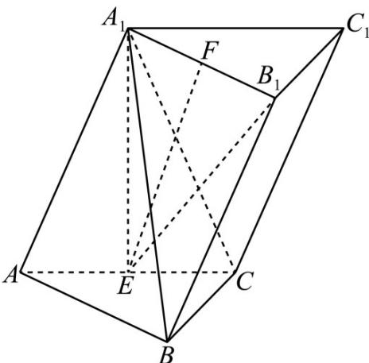
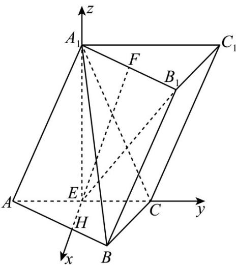

> [!faq]- 《专题21 立体几何大题综合》真题解析
>
> > [!success]- **【答案】** 详见解析
>
> > [!note]- **【分析】**
> > $^{(1)}$ 由题意首先证得线面垂直，然后利用线面垂直的定义即可证得线线垂直；
> >
> > (2)建立空间直角坐标系，分别求得直线的方向向量和平面的法向量，然后结合线面角的正弦值和同角三角函数基本关系可得线面角的余弦值·
>
> > [!note]- **【解析】**
> > (1)如图所示，连结 $A_{1}E, B_{1}E$
> > 
> > 等边 $\triangle AA_{1}C$ 中，AE = EC，则 $A_{1}E \perp AC$ ，
> > 平面 $ABC^{\perp}$ 平面 $A_{1}ACC_{1}$ ，且平面 $ABC \cap$ 平面 $A_{1}ACC_{1} = AC$
> > 由面面垂直的性质定理可得： $A_{1}E \perp$ 平面 ABC，故 $A_{1}E \perp BC$ ，
> > 由三棱柱的性质可知 $A_{1}B_{1}\parallel AB$ ，而 $AB\perp BC$ ，故 $A_{1}B_{1}\perp BC$ ，且 $A_{1}B_{1}\cap A_{1}E = A_{1}$
> > 由线面垂直的判定定理可得： $BC \perp$ 平面 $A_{1}B_{1}E$ ，
> > 结合 $EF \subseteq$ 平面 $A_{1}B_{1}E$ ，故 $EF \perp BC$ .
> > (2)在底面 $ABC$ 内作 $EH \perp AC$ ，以点 $E$ 为坐标原点， $EH, EC, EA_{1}$ 方向分别为 $x, y, z$ 轴正方向建立空间直角坐标系 $E - xyz$ .
> > 
> > 设 $EH = 1$ ，则 $AE = EC = \sqrt{3}$ ， $AA_{1} = CA_{1} = 2\sqrt{3}, BC = \sqrt{3}, AB = 3$
> > 据此可得： $A\left(0, - \sqrt{3},0\right),B\left(\frac{3}{2},\frac{\sqrt{3}}{2},0\right),A_1(0,0,3),C\left(0,\sqrt{3},0\right)$
> > 由 $AB = A_{1}B_{1}$ 可得点 $B_{1}$ 的坐标为 $B_{1}\left(\frac{3}{2},\frac{3}{2}\sqrt{3},3\right)$
> > 利用中点坐标公式可得： $F\left(\frac{3}{4},\frac{3}{4}\sqrt{3},3\right)$ ，由于 $E(0,0,0)$ ，
> > 故直线 $EF$ 的方向向量为： $\frac{EF}{EF} = \left(\frac{3}{4},\frac{3}{4}\sqrt{3},3\right)$
> > 设平面 $A_{1}BC$ 的法向量为 $\boxed{\sqcup}m = (x,y,z)$ ，则：
> > $$
> > \left\{\begin{array}{l}\stackrel {\rightharpoonup} {m} \cdot A _ {1} B = (x, y, z) \cdot \left(\frac {3}{2}, \frac {\sqrt {3}}{2}, - 3\right) = \frac {3}{2} x + \frac {\sqrt {3}}{2} y - 3 z = 0\\\stackrel {\rightharpoonup} {m} \cdot B C = (x, y, z) \cdot \left(- \frac {3}{2}, \frac {\sqrt {3}}{2}, 0\right) = - \frac {3}{2} x + \frac {\sqrt {3}}{2} y = 0\end{array}\right.
> > $$
> > 据此可得平面 $A_{1}BC$ 的一个法向量为 $\stackrel{\square}{m} = (1, \sqrt{3}, 1)$ ， $\stackrel{\square\square\square}{EF} = \left(\frac{3}{4}, \frac{3}{4}\sqrt{3}, 3\right)$
> > 此时 $\cos\left\langle\overrightarrow{EF},m\right\rangle=\frac{\overrightarrow{EF}\cdot m}{\left|EF\right|\times\left|m\right|}=\frac{6}{\sqrt{5}\times\frac{3\sqrt{5}}{2}}=\frac{4}{5}$
> > 设直线 EF 与平面 $A_{1}BC$ 所成角为 $\theta$ ，则 $\sin\theta=\cos\left\langle\overline{EF},m\right\rangle=\frac{4}{5},\cos\theta=\frac{3}{5}$ .
> > 【点睛】本题考查了立体几何中的线线垂直的判定和线面角的求解问题，意在考查学生的空间想象能力和逻辑推理能力；解答本题关键在于能利用直线与直线、直线与平面、平面与平面关系的相互转化，通过严密推理，同时对于立体几何中角的计算问题，往往可以利用空间向量法，通过求解平面的法向量，利用向量的夹角公式求解·
