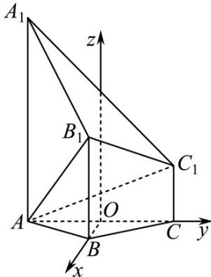
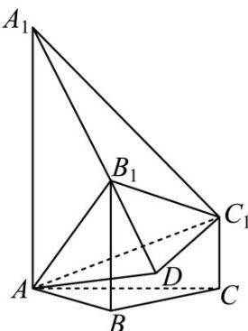
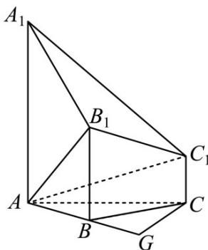
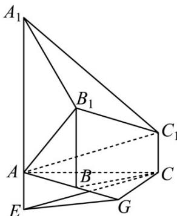
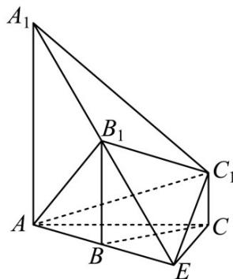

> [!faq]- 《专题21 立体几何大题综合》真题解析
>
> > [!success]- **【答案】** 详见解析
>
> > [!note]- **【分析】**
> > （Ⅰ）方法一：通过计算，根据勾股定理得 $AB_{1} \perp A_{1}B_{1}, AB_{1} \perp B_{1}C_{1}$ ，再根据线面垂直的判定定理得结论；
> >
> > (Ⅱ) 方法一：找出直线 $AC_{1}$ 与平面 $ABB_{1}$ 所成的角，再在直角三角形中求解即可.
>
> > [!note]- **【解析】**
> > （Ⅰ）[方法一]：几何法
> > 由 $AB = 2, AA_{1} = 4, BB_{1} = 2, AA_{1} \perp AB, BB_{1} \perp AB$ 得 $AB_{1} = A_{1}B_{1} = 2\sqrt{2}$
> > 所以 $A_{1}B_{1}^{2} + AB_{1}^{2} = AA_{1}^{2}$ ，即有 $AB_{1} \perp A_{1}B_{1}$ .
> > 由 $BC = 2$ ， $BB_{1} = 2, CC_{1} = 1, BB_{1} \perp BC, CC_{1} \perp BC$ 得 $B_{1}C_{1} = \sqrt{5}$
> > 由 $AB = BC = 2, \angle ABC = 120^{\circ}$ 得 $AC = 2\sqrt{3}$
> > 由 $CC_{1} \perp AC$ ，得 $AC_{1} = \sqrt{13}$ ，所以 $AB_{1}^{2} + B_{1}C_{1}^{2} = AC_{1}^{2}$ ，即有 $AB_{1} \perp B_{1}C_{1}$ ，又 $A_{1}B_{1} \cap B_{1}C_{1} = B_{1}$ ，因此 $AB_{1} \perp$ 平面 $A_{1}B_{1}C_{1}$ .
> > [方法二]：向量法
> > 如图，以 $AC$ 的中点 $O$ 为原点，分别以射线 $OB$ ， $OC$ 为 $x$ ， $y$ 轴的正半轴，建立空间直角坐标系 $O - xyz\cdot$
> > 
> > 由题意知各点坐标如下：
> > $$
> > A (0, - \sqrt {3}, 0), B (1, 0, 0), A _ {1} (0, - \sqrt {3}, 4), B _ {1} (1, 0, 2), C _ {1} (0, \sqrt {3}, 1),
> > $$
> > 因此 $\overline{AB}_{1}=(1,\sqrt{3},2),\overline{A_{1}B_{1}}=(1,\sqrt{3},-2),\overline{A_{1}C_{1}}=(0,2\sqrt{3},-3)$
> > 由 $AB_{1} \cdot A_{1}B_{1} = 0$ 得 $AB_{1} \perp A_{1}B_{1}$ ；由 $AB_{1} \cdot A_{1}C_{1} = 0$ 得 $AB_{1} \perp A_{1}C_{1}$ ，
> > 所以 $AB_{1} \perp$ 平面 $A_{1}B_{1}C_{1}$ .
> > (Ⅱ) [方法一]：定义法
> > 如图，过点 $C_1$ 作 $C_1D \perp A_1B_1$ ，交直线 $A_1B_1$ 于点 $D$ ，连结 $AD\cdot$
> > 
> > 由 $AB_{1} \perp$ 平面 $A_{1}B_{1}C_{1}$ 得平面 $A_{1}B_{1}C_{1} \perp$ 平面 $ABB_{1}$
> > 由 $C_{1}D \perp A_{1}B_{1}$ 得 $C_{1}D \perp$ 平面 $ABB_{1}$
> > 所以 $\angle C_{1}AD$ 是 $AC_{1}$ 与平面 $ABB_{1}$ 所成的角.
> > 由 $B_{1}C_{1} = \sqrt{5}, A_{1}B_{1} = 2\sqrt{2}, A_{1}C_{1} = \sqrt{21}$ 得 $\cos \angle C_{1}A_{1}B_{1} = \frac{\sqrt{6}}{\sqrt{7}}, \sin \angle C_{1}A_{1}B_{1} = \frac{1}{\sqrt{7}}$
> > 所以 $C_1D = \sqrt{3}$ ，故 $\sin \angle C_1AD = \frac{C_1D}{AC_1} = \frac{\sqrt{39}}{13}$
> > 因此，直线 $AC_{1}$ 与平面 $ABB_{1}$ 所成的角的正弦值是 $\frac{\sqrt{39}}{13}$ .
> > [方法二]：向量法
> > 设直线 $AC_{1}$ 与平面 $ABB_{1}$ 所成的角为 $\theta$ .
> > 由 $^{(1)}$ 可知 $AC_{1}=(0,2\sqrt{3},1)$ , $AB=(1,\sqrt{3},0)$ , $BB_{1}=(0,0,2)$ ,
> > 设平面 $ABB_{1}$ 的法向量 $n=(x,y,z)$ .
> > 由 $\left\{\begin{aligned}n\cdot AB&=0\\ \rightarrow &\square\square\square\\ n\cdot BB_{1}&=0\end{aligned}\right.$ 即 $\left\{\begin{aligned}x+\sqrt{3}y&=0\\ 2z&=0\end{aligned}\right.$ ，可取 $n=(-\sqrt{3},1,0)$ ，
> > 所以 $\sin\theta=\left|\cos\left\langle\overrightarrow{AC_{1}},n\right\rangle\right|=\frac{\left|\overrightarrow{AC_{1}}\cdot n\right|}{\left|AC_{1}\right|\cdot|n|}=\frac{\sqrt{39}}{13}$
> > 因此，直线 $AC_{1}$ 与平面 $ABB_{1}$ 所成的角的正弦值是 $\frac{\sqrt{39}}{13}$ .
> > [方法三]：【最优解】定义法 $^{+}$ 等积法
> > 设直线 $AC_{1}$ 与平面 $ABB_{1}$ 所成角为 $\theta$ ，点 $C_{1}$ 到平面 $ABB_{1}$ 距离为 d（下同）。因为 $C_{1}C\parallel$ 平面 $ABB_{1}$ ，所以点 C
> > 到平面 $ABB_{1}$ 的距离等于点 $C_1$ 到平面 $ABB_{1}$ 的距离．由条件易得，点 $C$ 到平面 $ABB_{1}$ 的距离等于点 $C$ 到直线
> > AB 的距离，而点 C 到直线 AB 的距离为 $\sqrt{3}$ ，所以 $d = \sqrt{3}$ 。故 $\sin\theta = \frac{d}{AC_{1}} = \frac{\sqrt{3}}{\sqrt{13}} = \frac{\sqrt{39}}{13}$ 。
> > [方法四]：定义法 $^{+}$ 等积法
> > 设直线 $AC_{1}$ 与平面 $ABB_{1}$ 所成的角为 $\theta$ ，由条件易得 $A_{1}B_{1}=2\sqrt{2}, B_{1}C_{1}=\sqrt{5}, A_{1}C_{1}=\sqrt{21}$ ，所以
> > $\cos \angle A_{1}B_{1}C_{1} = \frac{A_{1}B_{1}^{2} + B_{1}C_{1}^{2} - A_{1}C_{1}^{2}}{2A_{1}B_{1}\cdot B_{1}C_{1}} = -\frac{\sqrt{10}}{5}$ ，因此 $\sin \angle A_1B_1C_1 = \frac{\sqrt{15}}{5}$
> > 于是得 $S_{\triangle A_1B_1C_1} = \frac{1}{2} A_1B_1\cdot B_1C_1\cdot \sin \angle A_1B_1C_1 = \sqrt{6}$ ，易得 $S_{\triangle AA_1B_1} = 4$
> > 由 $V_{C_1 - AA_1B_1} = V_{A - A_1B_1C_1}$ 得 $\frac{1}{3} S_{\triangle AA_1B_1}\cdot d = \frac{1}{3} S_{\triangle A_1B_1C_1}\cdot AB_1$ ，解得 $d = \sqrt{3}$
> > 故 $\sin \theta = \frac{d}{AC_1} = \frac{\sqrt{3}}{\sqrt{13}} = \frac{\sqrt{39}}{13}$
> > [方法五]：三正弦定理的应用
> > 设直线 $AC_{1}$ 与平面 $ABB_{1}$ 所成的角为 $\theta$ ，易知二面角 $C_{1}-AA_{1}-B$ 的平面角为 $\angle BAC=\frac{\pi}{6}$ ，易得 $\sin\angle C_{1}AA_{1}=\frac{2\sqrt{3}}{\sqrt{13}}$
> > 所以由三正弦定理得 $\sin \theta = \sin \angle C_1AA_1\cdot \sin \angle BAC = \frac{2\sqrt{3}}{\sqrt{13}}\times \frac{1}{2} = \frac{\sqrt{39}}{13}$
> > [方法六]：三余弦定理的应用
> > 设直线 $AC_{1}$ 与平面 $ABB_{1}$ 所成的角为 $\theta$ ，如图 2，过点 C 作 $CG \perp AB$ ，垂足为 G，易得 $CG \perp$ 平面 $ABB_{1}$ ，所以 $CG$ 可看作平面 $ABB_{1}$ 的一个法向量。
> > 
> > 图2
> > 结合三余弦定理得 $\sin\theta=\left|\cos\left\langle AC_{1},CG\right\rangle\right|=\left|\cos\angle C_{1}AC\cdot\cos\angle GCA\right|=\frac{2\sqrt{3}}{\sqrt{13}}\times\frac{\sqrt{3}}{2\sqrt{3}}=\frac{\sqrt{39}}{13}$
> > [方法七]：转化法+定义法
> > 如图3，延长线段 $A_{1}A$ 至 $E$ ，使得 $AE = C_1C$
> > 
> > 图3
> > 联结 $CE$ ，易得 $EC \parallel AC_{1}$ ，所以 $AC_{1}$ 与平面 $ABB_{1}$ 所成角等于直线 $EC$ 与平面 $ABB_{1}$ 所成角．过点 $C$ 作 $CG \perp AB$ ，垂足为 $G$ ，联结 $GE$ ，易得 $CG \perp$ 平面 $ABB_{1}$ ，因此 $EG$ 为 $EC$ 在平面 $ABB_{1}$ 上的射影，所以 $\angle CEG$ 为直线 $_{EC}$ 与平面 $_{ABB_{1}}$ 所成的角．易得 $CE=\sqrt{13}$ ， $CG=\sqrt{3}$ ，因此 $\sin\angle CEG=\frac{CG}{CE}=\frac{\sqrt{3}}{\sqrt{13}}=\frac{\sqrt{39}}{13}$
> > [方法八]：定义法+等积法
> > 如图 $^{4}$ ，延长 $A_{1}B_{1}, AB$ 交于点 E，易知 BE = 2，又 AB = BC = 2，所以 $AC \perp CE$ ，故 $CE \perp$ 面 $AA_{1}C_{1}C$ 。设点 $C_{1}$ 到平面 $ABB_{1}$ 的距离为 h，由 $V_{E-AA_{1}C_{1}} = V_{C_{1}-AA_{1}E}$ 得 $\frac{1}{3} \times \frac{1}{2} AA_{1} \cdot AE \cdot h = \frac{1}{3} \times \frac{1}{2} AA_{1} \cdot AC \cdot CE$ ，解得 $h = \sqrt{3}$ 。
> > 
> > 图4
> > 又 $AC_{1} = \sqrt{13}$ ，设直线 $AC_{1}$ 与平面 $ABB_{1}$ 所成角为 $\theta$ ，所以 $\sin \theta = \frac{\sqrt{3}}{\sqrt{13}} = \frac{\sqrt{39}}{13}$
> > 【整体点评】（Ⅰ）方法一：通过线面垂直的判定定理证出，是该题的通性通法；
> > 方法二：通过建系，根据数量积为零，证出；
> > (Ⅱ) 方法一：根据线面角的定义以及几何法求线面角的步骤，“一作二证三计算”解出；
> > 方法二：根据线面角的向量公式求出；
> > 方法三：根据线面角的定义以及计算公式，由等积法求出点面距，即可求出，该法是本题的最优解；
> > 方法四：基本解题思想同方法三，只是求点面距的方式不同；
> > 方法五：直接利用三正弦定理求出；
> > 方法六：直接利用三余弦定理求出；
> > 方法七：通过直线平移，利用等价转化思想和线面角的定义解出；
> > 方法八：通过等价转化以及线面角的定义，计算公式，由等积法求出点面距，即求出。
