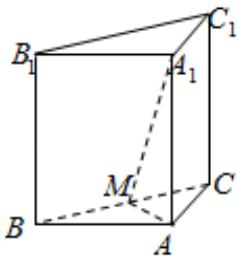

> [!faq]- 《专题21 立体几何大题综合》真题解析
>
> > [!success]- **【答案】** 详见解析
>
> > [!note]- **【分析】**
> > （1）三棱柱 $ABC-A_{1}B_{1}C_{1}$ 的体积 $V=S_{\Delta ABC}\times AA_{1}\times AC\times AA_{1}$ ，由此能求出结果；
> >
> > (2) 连结 $AM, \angle A_{1}MA$ 是直线 $A_{1}M$ 与平面 $ABC$ 所成角，由此能求出直线 $A_{1}M$ 与平面 $ABC$ 所成角的大小.
>
> > [!note]- **【解析】**
> > 解： $(1)$ ∵直三棱柱 $ABCA_{1}B_{1}C_{1}$ 的底面为直角三角形，
> > 两直角边 $AB$ 和 $AC$ 的长分别为 4 和 2，侧棱 $AA_{1}$ 的长为 5。
> > ∴三棱柱 $ABCA_{1}B_{1}C_{1}$ 的体积：
> > $$
> > V = S _ {\triangle} A B C \times A A _ {I}
> > $$
> > $$
> > = \frac {1}{2} \times A B \times A C \times A A _ {1}
> > $$
> > $$
> > = \frac {1}{2} \times 4 \times 2 \times 5 = 2 0
> > $$
> > (2) 连结 AM,
> > ∵直三棱柱 $ABC_{1}B_{1}C_{1}$ 的底面为直角三角形，
> > 两直角边 AB 和 AC 的长分别为 $^{4}$ 和 $^{2}$ ，侧棱 $AA_{1}$ 的长为 $^{5}$ ，M 是 BC 中点，
> > $\therefore AA_{1\perp}$ 底面 $ABC$ ， $AM = \frac{1}{2} BC = \frac{1}{2}\sqrt{16 + 4} = \sqrt{5}$
> > $\therefore \angle A_{1}MA$ 是直线 $A_{1}M$ 与平面 ABC 所成角，
> > $\tan_{\angle}A_{1}MA = \frac{AA_{1}}{AM} = \frac{5}{\sqrt{5}} = \sqrt{5}$
> > ∴直线 $A_{1}M$ 与平面 ABC 所成角的大小为 $\arctan\sqrt{5}$
> > 
> > 【点睛】本题考查三棱柱的体积的求法，考查线面角的大小的求法，考查空间中线线、线面、面面间的位置关系等基础知识，考查推理论证能力、运算求解能力、空间想象能力，考查化归与转化思想、函数与方程思想、数形结合思想，是中档题。
