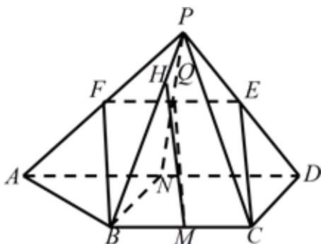

> [!faq]- 《专题21 立体几何大题综合》真题解析
>
> > [!success]- **【答案】** （Ⅰ）见解析；（Ⅱ） $\frac{\sqrt{2}}{8}$ 【详解】试题分析：本题主要考查空间点、线、面位置关系，直线与平面所成的角等基础知识，同时考查空间想象能力和运算求解能力．满分 $^{15}$ 分． (I) 取 $PA$ 中点 $F$ , 构造平行四边形 $BCEF$ , 可证明; (II) 由题意, 取 $BC$ , $AD$ 的中点 $M$ , $N$ , 可得 $AD \perp$ 平面 $PBN$ , 即 $BC \perp$ 平面 $PBN$ , 过点 $Q$ 作 $PB$ 的垂线, 垂足为 $H$ , 连结 $MH$ . 可知 $MH$ 是 $MQ$ 在平面 $PBC$ 上的射影, 所以 $\angle QMH$ 是直线 $CE$ 与平面 $PBC$ 所成的角. 依此可在 Rt△MQH 中, 求 $\angle QMH$ 的正弦值. 试题
>
> > [!note]- **【分析】**
> > 本题未单列分析。
>
> > [!note]- **【解析】**
> > 
> > (Ⅰ) 如图，设 $PA$ 中点为 $F$ ，连接 $EF$ ， $FB$ 。
> > 因为 $E$ ， $F$ 分别为 $PD$ ， $PA$ 中点，所以 $EF / / AD$ 且 $EF = \frac{1}{2} AD$
> > 又因为 $BC // AD$ ， $BC = \frac{1}{2} AD$ ，所以 $EF // BC$ 且 $EF = BC$ ，
> > 即四边形 $BCEF$ 为平行四边形，所以 $CE // BF$ ，
> > 因此 CE // 平面 PAB .
> > (II) 分别取 $BC$ , $AD$ 的中点为 $M$ , $N$ . 连接 $PN$ 交 $EF$ 于点 $Q$ , 连接 $MQ$
> > 因为 $E, F, N$ 分别是 $PD, PA, AD$ 的中点，所以 $Q$ 为 $EF$ 中点，
> > 在平行四边形 BCEF 中，MQ//CE。
> > 由 $\triangle PAD$ 为等腰直角三角形得 $PN\perp AD$
> > 由 $DC \perp AD$ ，N 是 AD 的中点得 $BN \perp AD$ 。
> > 所以 $AD \perp$ 平面 PBN，
> > 由 BC//AD 得 BC⊥平面 PBN，
> > 那么平面 $PBC \perp$ 平面 PBN .
> > 过点 Q 作 PB 的垂线，垂足为 H，连接 MH。
> > MH 是 MQ 在平面 PBC 上的射影，所以 $\angle QMH$ 是直线 CE 与平面 PBC 所成的角。
> > 设 CD=1 .
> > 在 $\triangle PCD$ 中，由 $PC = 2$ ， $CD = 1$ ， $PD = \sqrt{2}$ 得 $CE = \sqrt{2}$
> > 在 $\triangle PBN$ 中，由PN=BN=1，PB= $\sqrt{3}$ 得QH= $\frac{1}{4}$ ，
> > 在 Rt△MQH 中， $QH=\frac{1}{4}$ ，MQ= $\sqrt{2}$
> > 所以 $\sin\angle QMH=\frac{\sqrt{2}}{8}$ ，
> > 所以直线 $CE$ 与平面 $PBC$ 所成角的正弦值是 $\frac{\sqrt{2}}{8}$
> > 【名师点睛】本题主要考查线面平行的判定定理、线面垂直的判定定理及面面垂直的判定定理，属于中档题．证明线面平行的常用方法：①利用线面平行的判定定理，使用这个定理的关键是设法在平面内找到一条与已知直线平行的直线，可利用几何体的特征，合理利用中位线定理、线面平行的性质或者构造平行四边形、寻找比例式证明两直线平行．②利用面面平行的性质，即两平面平行，在其中一平面内的直线平行于另一平面．本题（1）是就是利用方法①证明的．另外，本题也可利用空间向量求解线面角．
