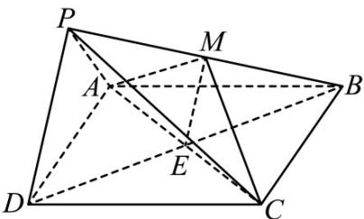
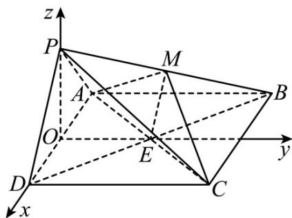

> [!faq]- 《专题21 立体几何大题综合》真题解析
>
> > [!success]- **【答案】** 详见解析
>
> > [!note]- **【分析】**
> > （1）设 $AC$ ， $BD$ 的交点为 $E$ ，由线面平行性质定理得 $PD \parallel ME$ ，再根据三角形中位线性质得 $M$ 为 $PB$ 的中点。（2）先根据条件建立空间直角坐标系，设立各点坐标，列方程组解各面法向量，根据向量数量积求向量夹角，最后根据二面角与向量夹角相等或互补关系求二面角大小（3）先根据条件建立空间直角坐标系，设立各点坐标，列方程组解各面法向量，根据向量数量积求向量夹角，最后根据线面角与向量夹角互余关系求线面角大小
>
> > [!note]- **【解析】**
> > （1）设 AC，BD 的交点为 E，连接 ME·因为 $PD \parallel$ 平面 $MAC$ ，平面 $MAC \cap$ 平面 $PDB = ME$ ，所以 $PD \parallel ME$ 。因为 $ABCD$ 是正方形，所以 $E$ 为 $BD$ 的中点，所以 $M$ 为 $PB$ 的中点。
> > 
> > (2) 取 的中点，连接，因为，所以
> > AD O OP OE PA = PD OP ⊥ AD
> > 又平面 $PAD \perp$ 平面 $ABCD$ ，且 $OP \subset$ 平面 $PAD$ ，所以 $OP \perp$ 平面 $ABCD$ ．因为 $OE \subset$ 平面 $ABCD$ ，所以 $OP \perp OE$ ．因为 $ABCD$ 是正方形，所以 $OE \perp AD$ ．
> > 如图，建立空间直角坐标系 $O - xyz$ ，则 $P(0,0,\sqrt{2})$ ， $D(2,0,0)$ ， $B(-2,4,0)$
> > 所以 $BD = (4, -4, 0)$ ， $PD = (2, 0, -\sqrt{2})$ .
> > 设平面 $_{BDP}$ 的法向量为 $n=(x,y,z)$ ，则 $\left\{\begin{aligned}\underline{n}\cdot\overline{BD}&=0\\n\cdot PD&=0\end{aligned}\right.$ ，即 $\left\{\begin{aligned}4x-4y&=0\\2x-\sqrt{2}z&=0\end{aligned}\right.$
> > 令 x=1 ，则 y=1， $z=\sqrt{2}$ ，于是 $n=\left(1,1,\sqrt{2}\right)$ .
> > 平面 $_{PAD}$ 的法向量为 $p=\left(0,1,0\right)$ ，所以 $\cos\left\langle n,p\right\rangle=\frac{u\cdot p}{\left|n\right|\left|p\right|}=\frac{1}{2}$
> > 由题知二面角 $B - PD - A$ 为锐角，所以它的大小为 $\frac{\pi}{3}$
> > 
> > (3) 由题意知 $M\left(-1,2,\frac{\sqrt{2}}{2}\right) \quad C(2,4,0) \quad MC=\left(3,2,-\frac{\sqrt{2}}{2}\right)$
> > 设直线 $MC$ 与平面 $BDP$ 所成角为 $\alpha$ ，则 $\sin \alpha = \left|\cos \left\langle n, MC \right\rangle\right| = \frac{\left|n \cdot MC\right|}{\left|n\right|\left|MC\right|} = \frac{2\sqrt{6}}{9}$ .
> > 所以直线 MC 与平面 BDP 所成角的正弦值为 $\frac{2\sqrt{6}}{9}$ .
