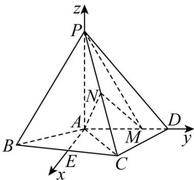

> [!faq]- 《专题21 立体几何大题综合》真题解析
>
> > [!success]- **【答案】** 详见解析
>
> > [!note]- **【分析】**
> > 本题未单列分析。
>
> > [!note]- **【解析】**
> > 【答案】（Ⅰ）详见解析；（Ⅱ） $\frac{8\sqrt{5}}{25}$
> > 【详解】（Ⅰ）由已知得 $AM = \frac{2}{3} AD = 2$ .
> > 取 $BP$ 的中点 $T$ ，连接 $AT, TN$ ，由 $N$ 为 $PC$ 中点知 $TN // BC$ ， $TN = \frac{1}{2} BC = 2$ .
> > 又 $AD \parallel BC$ ，故 $TN \parallel AM$ ， $TN = AM$ ，四边形 $AMNT$ 为平行四边形，于是 $MN \parallel AT$ 。
> > 因为 $AT \subset$ 平面 PAB， $MN \not\subset$ 平面 PAB，所以 $MN \parallel$ 平面 PAB.
> > (Ⅱ) 取 BC 的中点 E，连结 AE·由 AB = AC 得 $AE \perp BC$ ，从而 $AE \perp AD$ ，
> > 且 $AE = \sqrt{AB^2 - BE^2} = \sqrt{AB^2 - \left(\frac{BC}{2}\right)^2} = \sqrt{5}$ .
> > 以 A 为坐标原点， $AE$ 的方向为 x 轴正方向，建立如图所示的空间直角坐标系 | A - xyz .
> > 由题意知，
> > $P(0,0,4)$ ， $M(0,2,0)$ ， $C(\sqrt{5},2,0)$ ， $N\left(\frac{\sqrt{5}}{2},1,2\right)$
> > $\overline{PM}=(0,2,-4)$ ， $\overrightarrow{PN}=\left(\frac{\sqrt{5}}{2},1,-2\right)$ ， $\overrightarrow{AN}=\left(\frac{\sqrt{5}}{2},1,2\right)$ .
> > 设 $n = (x,y,z)$ 为平面PMN的一个法向量，则
> > $\left\{ \begin{array}{l} n \cdot P M = 0, \\ \rightarrow \square \square \\ n \cdot P N = 0, \end{array} \right.$ 即 $\left\{ \begin{array}{l} 2y - 4z = 0, \\ \frac{\sqrt{5}}{2} x + y - 2z = 0, \end{array} \right.$
> > 可取 $n = (0,2,1)$
> > 于是 $\left|\cos\langle n,AN\rangle\right|=\frac{\left|\begin{matrix}n\cdot AN\\ \rightarrow\end{matrix}\right|}{\left|n\right|\left|AN\right|}=\frac{8\sqrt{5}}{25}.$
> > 
> > 【考点】空间线面间的平行关系，空间向量法求线面角.
> > 【技巧点拨】（1）证明立体几何中的平行关系，常常是通过线线平行来实现，而线线平行常常利用三角形的中位线、平行四边形与梯形的平行关系来推证；（2）求解空间中的角和距离常常可通过建立空间直角坐标系，利用空间向量中的夹角与距离来处理。
