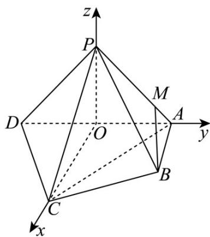

> [!faq]- 《专题21 立体几何大题综合》真题解析
>
> > [!success]- **【答案】** 详见解析
>
> > [!note]- **【分析】**
> > 本题未单列分析。
>
> > [!note]- **【解析】**
> > 【答案】（1）见解析；（2） $\frac{\sqrt{3}}{3}$ ；（3）存在， $\frac{AM}{AP}=\frac{1}{4}$
> > 【详解】试题分析：（1）由面面垂直性质定理知 $AB \perp$ 平面 $PAD$ ；根据线面垂直性质定理可知 $AB \perp PD$ ，再由线面垂直判定定理可知 $PD \perp$ 平面 $PAB$ ；（2）取 $AD$ 的中点 $O$ ，连结 $PO$ ， $CO$ ，以为坐标原点建立空间直角坐标系 $O - xyz$ ，利用向量法可求出直线 $PB$ 与平面 $PCD$ 所成角的正弦值；（3）假设存在，根据 $A$ ， $P$ ， $M$ 三点共线，设 $\overrightarrow{AM} = \lambda \overrightarrow{AP}$ ，根据 $BM //$ 平面 $PCD$ ，即 $\overrightarrow{BM} \cdot \hat{n} = 0$ ，求 $\lambda$ 的值，即可求出 $\frac{AM}{AP}$ 的值·
> > 试题
> > 【答案】（1）见解析；（2） $\frac{\sqrt{3}}{3}$ ；（3）存在， $\frac{AM}{AP}=\frac{1}{4}$
> > 【详解】试题分析：（1）由面面垂直性质定理知 $AB \perp$ 平面 $PAD$ ；根据线面垂直性质定理可知 $AB \perp PD$ ，再由线面垂直判定定理可知 $PD \perp$ 平面 $PAB$ ；（2）取 $AD$ 的中点 $O$ ，连结 $PO$ ， $CO$ ，以为坐标原点建立空间直角坐标系 $O - xyz$ ，利用向量法可求出直线 $PB$ 与平面 $PCD$ 所成角的正弦值；（3）假设存在，根据 $A$ ， $P$ ， $M$ 三点共线，设 $\overrightarrow{AM} = \lambda \overrightarrow{AP}$ ，根据 $BM //$ 平面 $PCD$ ，即 $\overrightarrow{BM} \cdot \hat{n} = 0$ ，求 $\lambda$ 的值，即可求出 $\frac{AM}{AP}$ 的值·
> > 试题解析：（1）因为平面 $PAD \perp$ 平面 ABCD ， $AB \perp AD$ ，
> > 所以 $AB \perp$ 平面 PAD ，所以 $AB \perp PD$
> > 又因为 $PA \perp PD$ ，所以 $PD \perp$ 平面 PAB；
> > (2) 取 AD 的中点 O，连结 PO，CO，
> > 因为 $PA = PD$ ，所以 $PO \perp AD$ .
> > 又因为 $PO \subset$ 平面 PAD ，平面 $PAD \perp$ 平面 ABCD ，
> > 所以 $PO \perp$ 平面ABCD.
> > 因为 $CO \subset$ 平面ABCD，所以 $PO \perp CO$ .
> > 因为 AC = CD ，所以 $CO \perp AD$ .
> > 如图建立空间直角坐标系 $O - xyz$ ，由题意得，
> > $$
> > A (0, 1, 0), B (1, 1, 0), C (2, 0, 0), D (0, - 1, 0), P (0, 0, 1).
> > $$
> > 设平面 $PCD$ 的法向量为 $\vec{n} = (x, y, z)$ ，则
> > $\left\{ \begin{array}{l} \overrightarrow{n} \cdot \overrightarrow{PD} = 0, \\ \overrightarrow{n} \cdot \overrightarrow{PC} = 0, \end{array} \right.$ 即 $\left\{ \begin{array}{l} -y - z = 0, \\ 2x - z = 0, \end{array} \right.$
> > 令 $z = 2$ ，则 $x = 1, y = -2$ .
> > 所以 $\vec{n}=(1,-2,2)$ .
> > 又 $\overrightarrow{PB} = (1,1,-1)$ ，所以 $\cos <\overrightarrow{n},\overrightarrow{PB} > = \frac{\overrightarrow{n}\cdot\overrightarrow{PB}}{\left|\overrightarrow{n}\right|\left|\overrightarrow{PB}\right|} = -\frac{\sqrt{3}}{3}$ .
> > 所以直线 $_{PB}$ 与平面 $_{PCD}$ 所成角的正弦值为 $\frac{\sqrt{3}}{3}$
> > 
> > (3) 设 $M$ 是棱 $PA$ 上一点，则存在 $\lambda \in [0,1]$ 使得 $\overrightarrow{AM} = \lambda \overrightarrow{AP}$ .
> > 因此点 $M(0,1 - \lambda ,\lambda),\overrightarrow{BM} = (-1, - \lambda ,\lambda)$
> > 因为 $BM \not\subset$ 平面 $PCD$ ，所以 $BM \parallel$ 平面 $PCD$ 当且仅当 $\overrightarrow{BM} \cdot \overrightarrow{n} = 0$
> > 即 $(-1, -\lambda, \lambda) \cdot (1, -2, 2) = 0$ ，解得 $\lambda = \frac{1}{4}$ .
> > 所以在棱 $PA$ 上存在点 $M$ 使得 $BM \parallel$ 平面 $PCD$ ，此时 $\frac{AM}{AP} = \frac{1}{4}$
> > 考点： $^{1}$ ·空间垂直判定与性质； $^{2}$ ·异面直线所成角的计算； $^{3}$ ·空间向量的运用·
