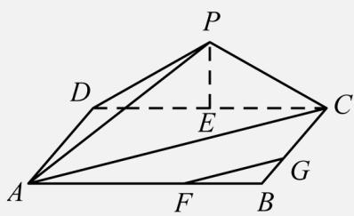

> [!faq]- 《专题21 立体几何大题综合》真题解析
>
> > [!success]- **【答案】** 详见解析
>
> > [!note]- **【分析】**
> > （1）通过 $\triangle PDC$ 为等腰三角形可得 $PE_{\perp}CD$ ，利用线面垂直判定定理及性质定理即得结论；
> >
> > (2) 通过 (1) 及面面垂直定理可得 $PG_{\perp}AD$ ，则 $\angle PDC$ 为二面角 $PAD_{C}$ 的平面角，利用勾股定理即得结论；
> >
> > (3) 连结 $AC$ ，利用勾股定理及已知条件可得 $FG \parallel AC$ ，在 $\triangle PAC$ 中，利用余弦定理即得直线 $PA$ 与直线 $FG$ 所成角的余弦值。
>
> > [!note]- **【解析】**
> > （1）证明：在△PDC中PO=PC且E为CD中点，
> > $\therefore PE_{\perp}CD$
> > 又∵平面 $PDC_{\perp}$ 平面 ABCD，平面 $PDC_{\cap}$ 平面 ABCD = CD， $PE \subset$ 平面 PCD，
> > $\therefore PE_{\perp}$ 平面 ABCD，
> > 又∵FG⊂平面ABCD，
> > $\therefore PE_{\perp}FG;$
> > (2) 解：由 (1) 知 $PE_{\perp}$ 平面 ABCD，∴ $PE_{\perp}AD$ ，
> > 又∵ $CD_{\perp}AD$ 且 $PE\cap CD=E$ ，$\therefore AD_{\perp}$ 平面 $PDC$ ，
> > 又 $\because PD\subset$ 平面 $PDC$ ， $\therefore AD_{\perp}PD$ ，
> > 又 $\because AD_{\perp}CD$ ， $\therefore \angle PDC$ 为二面角PAD.C的平面角，
> > 在 Rt△PDE 中，由勾股定理可得： $PE = \sqrt{PD^2 - DE^2} = \sqrt{4^2 - 3^2} = \sqrt{7}$ ， $\therefore \tan \angle PDC = \frac{PG}{DG} = \frac{\sqrt{7}}{3}$ ：
> > （3）解：连结 $AC$ ，则 $AC = \sqrt{6^2 + 3^2} = 3\sqrt{5}$ ，
> > 在 Rt△ADP 中， $AP = \sqrt{AD^2 + DP^2} = \sqrt{3^2 + 4^2} = 5$ ， $\because AF = 2FB$ ， $CG = 2GB$ ， $\therefore FG\| AC$ ，
> > ∴直线 PA 与直线 FG 所成角即为直线 PA 与直线 AC 所成角 $\angle PAC$ ，
> > 在 $\triangle PAC$ 中，由余弦定理得 $\cos\angle PAC=\frac{PA^{2}+AC^{2}-PC^{2}}{2PA\cdot AC}$ $=\frac{5^{2}+(3\sqrt{5})^{2}-4^{2}}{2\times5\times3\sqrt{5}}$ $=\frac{9}{25}\sqrt{5}$
> > 
> > ## 【点睛】
> > 本题考查线线垂直的判定、二面角及线线角的三角函数值，涉及到勾股定理、余弦定理等知识，注意解题方法的积累，属于中档题。
