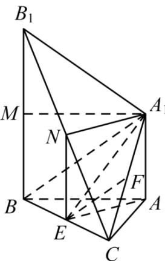

> [!faq]- 《专题21 立体几何大题综合》真题解析
>
> > [!success]- **【答案】** （Ⅰ）见试题解析；（Ⅱ）见试题解析；（Ⅲ）30°.
>
> > [!note]- **【分析】**
> > 本题未单列分析。
>
> > [!note]- **【解析】**
> > （Ⅰ）要证明 $EF \parallel$ 平面 $A_{1}B_{1}BA$ ，只需证明 $\angle A_{1}B_{1}N$ 且 $EF \not\subsetneq$ 平面 $A_{1}B_{1}BA$ ;（Ⅱ）要证明平面 $\angle A_{1}B_{1}N$ 平面 $BCB_{1}$ ，可证明 $AE \perp BC, BB_{1} \hat{} AE$ ;（Ⅲ）取 $A_{1}N$ 中点 N，连接 $A_{1}B_{1}$ ，则 $AEA_{1} \hat{}$ 就是直线 $A_{1}B_{1}$ 与平面 $BCB_{1}$ 所成角， $Rt\triangle A_{1}BC$ 中，由 $\sin\angle A_{1}B_{1}N=\frac{A_{1}N}{A_{1}B}=\frac{1}{2}$ ，得直线 $A_{1}B_{1}$ 与平面 $BCB_{1}$ 所成角为 $30^{\circ}$ .
> > 试题解析: (I) 证明: 如图, 连接 $A_{1}C$ , 在 $\triangle BCB_{1}$ 中, 因为 $E$ 和 $F$ 分别是 $BC, BB_{1}$ 的中点, 所以 $\angle A_{1}B_{1}N$ , 又因为 $EF$ 平面 $A_{1}B_{1}BA$ , 所以 $EFI$ 平面 $A_{1}B_{1}BA$ .
> > (II) 因为 $AB = AC, E$ 为 $BC$ 中点, 所以 $AE \perp BC$ , 因为 $A_{1}N \perp$ 平面 $ABC, BB_{1} \parallel AA_{1}$ , 所以 $A_{1}N \perp$ 平面 $ABC$ , 从而 $BB_{1} \wedge AE$ , 又 $\angle A_{1}B_{1}N = 30^{\circ}$ , 所以 $AE \perp$ 平面 $BCB_{1}$ , 又因为 $AE \perp$ 平面 $BCB_{1}$ , 所以平面 $\angle A_{1}B_{1}N$ 平面 $BCB_{1}$ .
> > 
> > （Ⅲ）取 $B_{1}C$ 中点 $\mathsf{M}$ 和 $A_{1}N$ 中点 $\mathsf{N}$ ，连接 $NE = AA_{1}, A_{1}B_{1}$ 因为 $\mathsf{N}$ 和 $\mathsf{E}$ 分别为 $A_{1}N, BC$ 中点，所以 $NE \parallel BB_{1}$ ， $NE = \frac{1}{2}BB_{1}$ ，故 $NE \parallel AA_{1}$ ， $AB \perp BB_{1}$ ，所以 $A_{1}N \parallel AE$ ， $A_{1}N = AE$ ，又因为 $AE \perp$ 平面 $BCB_{1}$ ，所以 $A_{1}MB_{1}$ 平面 $BCB_{1}$ ，从而 $AEA_{1}^{\wedge}$ 就是直线 $A_{1}B_{1}$ 与平面 $BCB_{1}$ 所成角，在 $\triangle ABC$ 中，可得 $AE = 2$ ，所以 $A_{1}N = AE = 2$ ，因为 $BM \parallel AA_{1}, BM = AA_{1}$ ，所以 $A_{1}M \parallel AB, A_{1}M = AB$ 。又由 $AB \perp BB_{1}$ ，有 $A_{1}M \perp BB_{1}$ ，在 Rt $\triangle A_{1}MB_{1}$ 中，可得 $A_{1}B_{1} = \sqrt{B_{1}M^{2} + A_{1}M^{2}} = 4$ ，在 Rt $\triangle A_{1}BC$ 中， $\sin \angle A_{1}B_{1}N = \frac{A_{1}N}{A_{1}B} = \frac{1}{2}$ ，因此 $\angle A_{1}B_{1}N = 30^{\circ}$ ，所以，直线 $A_{1}B_{1}$ 与平面 $BCB_{1}$ 所成角为 $30^{\circ}$ 。
> > 考点：本题主要考查空间中线面位置关系的证明，直线与平面所成的角等基础知识，考查空间想象能力及推理论证能力。
