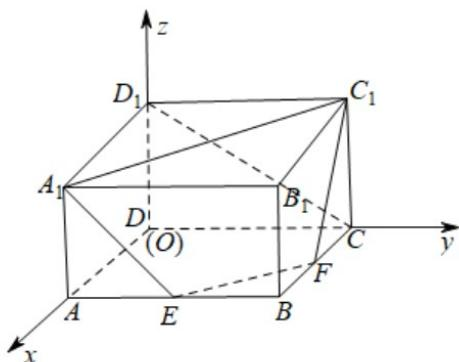

> [!faq]- 《专题21 立体几何大题综合》真题解析
>
> > [!success]- **【答案】** 详见解析
>
> > [!note]- **【分析】**
> > 本题未单列分析。
>
> > [!note]- **【解析】**
> > 【答案】 $\arcsin \frac{\sqrt{15}}{15}$
> > 【详解】解：如图，以 D 为原点建立空间直角坐标系，可得有关点的坐标为 $A_{1}(2,0,1)$ 、 $C_{1}(0,2,1)$ 、 $E(2,1,0)$ 、 $F(1,2,0)$ 、 $C(0,2,0)$ 、 $D_{1}(0,0,1)$ 。
> > 
> > 因为 $\mathrm{A}_{1}\mathrm{C}_{1}=\left(-2,2,0\right)$ ， $\mathrm{EF}=\left(-1,1,0\right)$
> > 所以 $A_{1}C_{1}//EF$ ，因此直线 $A_{1}C_{1}$ 与 EF 共面，
> > 即 $\mathrm{A}_{1}$ 、 $\mathrm{C}_{1}$ 、F、E共面.
> > 设平面 $A_{1}C_{1}EF$ 的法向量为 $n = (u,y,w)$ ，则 $n \perp \mathrm{EF}$ ， $n \perp \mathrm{FC}_{1}$
> > 又 $\mathrm{EF} = (-1,1,0)$ ， $\mathrm{FC}_1 = (-1,0,1)$
> > 故 $\left\{ \begin{array}{l} -u + v = 0 \\ -u + w = 0 \end{array} \right.$ ，解得 $u = v = w$ 。
> > 取 $u = 1$ ，得平面 $\mathrm{A}_1\mathrm{C}_1\mathrm{FE}$ 的一个法向量 $\vec{n} = (1,1,1)$ .又 $\overline{\mathrm{CD}}_1 = (0, - 2,1)$
> > 故 $\frac{\overrightarrow{CD_{1}}\cdot n}{|\overrightarrow{CD_{1}}||n|} = -\frac{\sqrt{15}}{15}$
> > 因此直线 $CD_{1}$ 与平面 $A_{1}C_{1}FE$ 所成的角的大小为 $\arcsin \frac{\sqrt{15}}{15}$
> > 考点：空间向量求线面角
