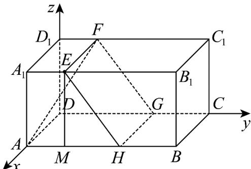

> [!faq]- 《专题21 立体几何大题综合》真题解析
>
> > [!success]- **【答案】** 详见解析
>
> > [!note]- **【分析】**
> > 本题未单列分析。
>
> > [!note]- **【解析】**
> > 【答案】（Ⅰ）详见解析；（Ⅱ） $\frac{4\sqrt{5}}{15}$
> > 【详解】（I）交线围成的正方形 $EHGF$ 如图：
> > （Ⅱ）作 $EM \perp AB$ ，垂足为 $M$ ，则 $AM = A_1E = 4$ ， $EM = AA_1 = 8$ ，因为 $EHGF$ 为正方形，所以 $EH = EF = BC = 10$ 。于是 $MH = \sqrt{EH^2 - EM^2} = 6$ ，所以 $AH = 10$ 。以 $D$ 为坐标原点， $DA$ 的方向为 $x$ 轴的正方向，建立如图所示的空间直角坐标系 $D - xyz$ ，则 $A(10,0,0)$ ， $H(10,10,0)$ ， $E(10,4,8)$ ，
> > $F(0,4,8)$ ， $FE=(10,0,0)$ ， $HE=(0,-6,8)$ 。设 $n=(x,y,z)$ 是平面 EHGF 的法向量，则 $\left\{\begin{aligned}&n\cdot FE=0,\\&n\cdot HE=0,\end{aligned}\right.$ 即 $\left\{\begin{aligned}&10x=0,\\&-6y+8z=0,\end{aligned}\right.$ 所以可取 $n=(0,4,3)$ 。又 $AF=(-10,4,8)$ ，故 $\left|\cos\left\langle n,AF\right\rangle\right|=\frac{\left|n\cdot AF\right|}{\left|n\right|\cdot\left|AF\right|}=\frac{4\sqrt{5}}{15}$ 。所以直线
> > AF 与平面 $\alpha$ 所成角的正弦值为 $\frac{4\sqrt{5}}{15}$
> > 考点： $^{1}$ 、直线和平面平行的性质； $^{2}$ 、直线和平面所成的角。
> > 
