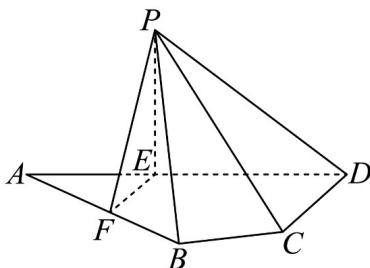

<!-- question-source:start -->
1．（2024·全国新Ⅱ卷·高考真题）如图，平面四边形ABCD中，AB=8，CD=3，AD=5 $\sqrt{3}$

$\angle ADC = 90^{\circ}$ ， $\angle BAD = 30^{\circ}$ ，点 $E$ ， $F$ 满足 $\frac{AE}{5} = \frac{2}{5} \frac{AD}{AD}$ ， $\frac{AF}{2} = \frac{1}{2} \frac{AB}{AB}$ ，将 $\triangle AEF$ 沿 $EF$ 翻折至！ $PEF$ ，使得 $PC = 4\sqrt{3}$

<!-- question-source:end -->

![[高中/真题/按题型分类/专题21 立体几何大题综合/考点07_求二面角及最值或范围/真题/answers/Q00035927A1.md]]
