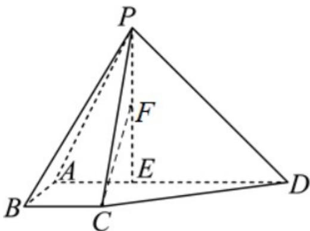

<!-- question-source:start -->
3．（2024·北京·高考真题）如图，在四棱锥 P-ABCD 中，BC//AD，AB=BC=1，AD=3，点 E 在 AD 上，且 $PE \perp AD$ ，PE=DE=2。

(1)若 F 为线段 PE 中点，求证： $BF \parallel$ 平面 PCD。

(2)若 $AB \perp$ 平面 $PAD$ ，求平面 $PAB$ 与平面 $PCD$ 夹角的余弦值。
<!-- question-source:end -->

![[高中/真题/按题型分类/专题21 立体几何大题综合/考点07_求二面角及最值或范围/真题/answers/Q00035929A1.md]]
