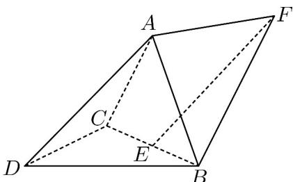

<!-- question-source:start -->
5．（2023·全国新Ⅱ卷·高考真题）如图，三棱锥 A-BCD 中，DA=DB=DC，BD⊥CD， $\angle ADB = \angle ADC = 60^{\circ}$ ，E 为 BC 的中点。

(1)证明： $BC\perp DA$

(2) 点 F 满足 $EF = DA$ ，求二面角 D - AB - F 的正弦值。
<!-- question-source:end -->

![[高中/真题/按题型分类/专题21 立体几何大题综合/考点07_求二面角及最值或范围/真题/answers/Q00035931A1.md]]
