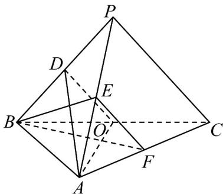

<!-- question-source:start -->
6．（2023·全国乙卷·高考真题）如图，在三棱锥 P-ABC 中， $AB \perp BC$ ，AB = 2， $BC = 2\sqrt{2}$ ， $PB = PC = \sqrt{6}$ ，BP，AP，BC 的中点分别为 D，E，O， $AD = \sqrt{5}DO$ ，点 F 在 AC 上， $BF \perp AO$ .

(1)证明： $EF \parallel$ 平面 ADO；

(2)证明：平面 $ADO \perp$ 平面 BEF；

(3)求二面角 $D - AO - C$ 的正弦值.
<!-- question-source:end -->

![[高中/真题/按题型分类/专题21 立体几何大题综合/考点07_求二面角及最值或范围/真题/answers/Q00035932A1.md]]
