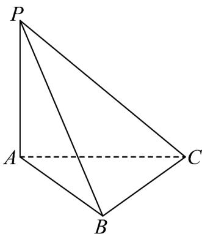

<!-- question-source:start -->
7．（2023·北京·高考真题）如图，在三棱锥 P-ABC 中， $PA \perp$ 平面 ABC， $PA = AB = BC = 1, PC = \sqrt{3}$

<!-- question-source:end -->

![[高中/真题/按题型分类/专题21 立体几何大题综合/考点07_求二面角及最值或范围/真题/answers/Q00035933A1.md]]
