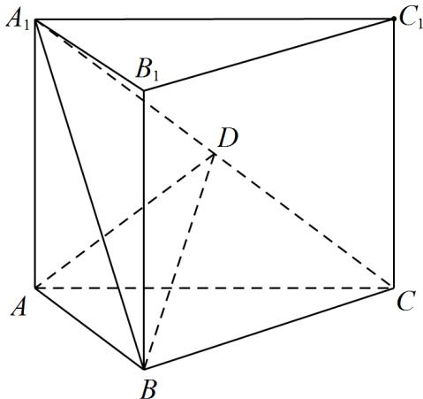

<!-- question-source:start -->
9.（2022·全国新I卷·高考真题）如图，直三棱柱 $ABC - A_{1}B_{1}C_{1}$ 的体积为4， $\triangle A_{1}BC$ 的面积为 $2\sqrt{2}$

<!-- question-source:end -->

![[高中/真题/按题型分类/专题21 立体几何大题综合/考点07_求二面角及最值或范围/真题/answers/Q00035935A1.md]]
