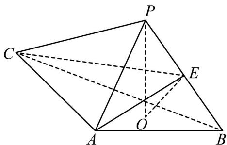

<!-- question-source:start -->
10．（2022·全国新Ⅱ卷·高考真题）如图，PO 是三棱锥 P-ABC 的高，PA=PB， $AB\perp AC$ ，E 是 PB 的中点．

(1)证明： $OE \parallel$ 平面 PAC；

(2)若 $\angle ABO = \angle CBO = 30^{\circ}$ ， $PO = 3$ ， $PA = 5$ ，求二面角 $C - AE - B$ 的正弦值.
<!-- question-source:end -->

![[高中/真题/按题型分类/专题21 立体几何大题综合/考点07_求二面角及最值或范围/真题/answers/Q00035936A1.md]]
