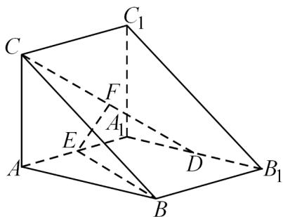

<!-- question-source:start -->
11．（2022·天津·高考真题）直三棱柱 $ABC - A_{1}B_{1}C_{1}$ 中， $AA_{1} = AB = AC = 2, AA_{1} \perp AB, AC \perp AB$ ，D 为 $A_{1}B_{1}$ 的中点，E 为 $AA_{1}$ 的中点，F 为 CD 的中点．

<!-- question-source:end -->

![[高中/真题/按题型分类/专题21 立体几何大题综合/考点07_求二面角及最值或范围/真题/answers/Q00035937A1.md]]
